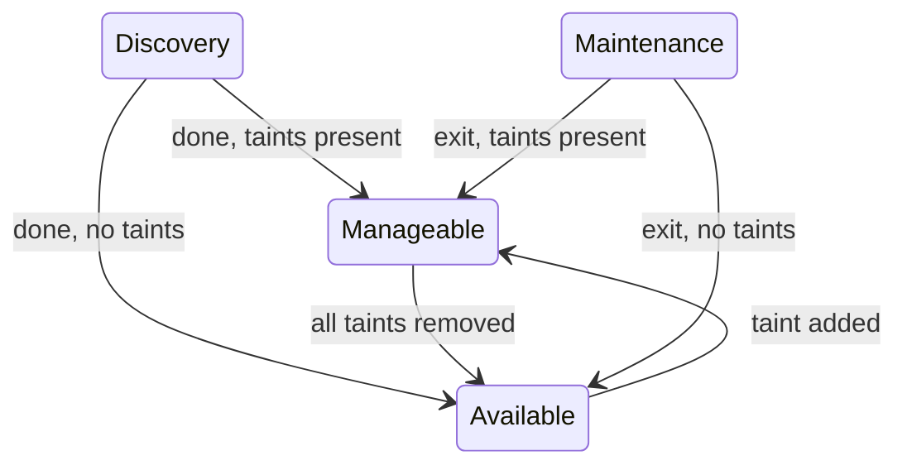
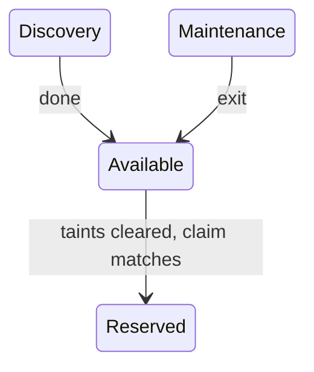

# IEP-0014: Availability Gating for IronCore Servers

## Table of Contents

- [Summary](#summary)
- [Motivation](#motivation)
    - [Goals](#goals)
    - [Non-Goals](#non-goals)
- [Proposal](#proposal)
    - [Open question: gating at state vs. binding level](#open-question-gating-at-state-vs-binding-level)
    - [Opt-in via BMC label](#opt-in-via-bmc-label)
    - [Taint on Server](#taint-on-server)
    - [Components](#components)
    - [ServerMetadata ownership](#servermetadata-ownership)
- [Dependencies](#dependencies)

## Summary

Introduce a generic availability gating mechanism that allows external services to block servers from reaching `Available` state until their gates pass. The first use case is network topology verification, but the mechanism is designed to support any type of gate.

## Motivation

Servers entering the fleet may be physically wired incorrectly or fail other pre-availability gates. Without a gating mechanism, a server can reach `Available` state and get claimed before these gates pass, leading to issues at workload runtime. The gating should be automatic for new and maintenance-returning servers, transparent to the workload layer, and extensible to multiple gate types.

### Goals

- Block servers from becoming `Available` until all registered gates pass *(Option A; under Option B servers reach `Available` but cannot be claimed)*
- Support multiple concurrent gate types
- Work for both argora-managed and auto-discovered servers
- Be transparent to the workload scheduling layer

### Non-Goals

- Defining the specific gates run by external services
- Replacing existing maintenance workflows

## Proposal

### Open question: gating at state vs. binding level

Server taints (`NoBind` effect) are now available in metal-operator. This opens two approaches for where availability gating is enforced, and the choice affects how much state machine work is needed.

#### Option A — Gate at state (`Manageable` state)

The state machine enforces the gate: `Discovery → Manageable` (if taints present) → `Available` (all taints cleared). `Available` only contains genuinely ready servers.



metal-operator work: BMC-label → taint creation, new `Manageable` state constant, and state transition logic that holds in `Manageable` while any `NoBind` taint is present.

**Tradeoff:** More work, but `Available` means what it says. State-based filtering, dashboards, and alerting work naturally without inspecting taints. metal-gate can watch `Manageable` state directly instead of filtering by taint key.

#### Option B — Gate at binding (no `Manageable` state)

`NoBind` taints are set on the server at `Initial` → `Discovery`. The server still reaches `Available` normally, but no `ServerClaim` can bind to it until all taints are removed.



metal-operator work: BMC-label → taint creation only. No new state machine states.

**Tradeoff:** Simpler to implement. A server waiting on gates looks identical to a ready server from a state perspective — the difference is only visible in `spec.taints`. Filtering "servers currently gated" requires a field selector on taints, not a state filter.

### Opt-in via BMC label

External services register a gate by setting a label on the `BMC` object:

```yaml
metadata:
  labels:
    metal.ironcore.dev/gate-network: "true"
```

The label key format is `metal.ironcore.dev/gate-<topic>: "true"`. Multiple labels can be present simultaneously.

The `BMC` object is the natural carrier for these labels because it is the first object created in both onboarding paths:
- **argora-managed servers**: argora creates the BMC directly from NetBox data (inline IP, no `Endpoint` object is created)
- **auto-discovered servers**: metal-operator's `EndpointReconciler` creates the BMC from a discovered `Endpoint` object

In both cases the BMC exists before the server reaches `Initial` state, making it the earliest reliable point to read gate requirements.

### Taint on Server

At the `Initial` → `Discovery` transition, metal-operator reads the `BMC` labels and sets a corresponding taint on the `Server` for each matching label:

```yaml
spec:
  taints:
  - key: metal.ironcore.dev/gate-network
    effect: NoBind
```

The taint key mirrors the label key exactly. Reading labels at this transition (rather than at `Initial`) gives external services time to set their labels on the BMC before taints are created.

### Components

**metal-operator**
- Set `gate-*` taints at `Initial` → `Discovery` transition based on `BMC` labels
- Implement `Manageable` state in the server state machine (Option A only)
- Write LLDP/interface data to a CRD during Discovery

**argora**
- Creates BMC objects with inline IP sourced from NetBox (no `Endpoint` object)
- Continuously reconcile `ServerMetadata.spec.interfaces` with expected topology from NetBox

**metal-gate** (new microservice)
- Watch `BMC` objects and patch `metal.ironcore.dev/gate-*` labels based on cluster spec (which gates are required for that server)
- Watch servers in `Manageable` state (Option A) or with `gate-*` taints (Option B)
- Run configured gates, remove taints on pass, alert on mismatch

### ServerMetadata ownership

`ServerMetadata` is proposed as a shared CRD with split ownership by subresource:

- `status.interfaces` — owned by metal-operator, populated with discovered LLDP data during Discovery. metal-operator is the sole writer via the `/status` subresource.
- `spec.interfaces` — owned by external services (e.g. argora), populated with expected topology from an authoritative source (e.g. NetBox). External services write this via normal `Update` on the spec.

This pattern is valid in Kubernetes — it is common for operators to own `status` while external actors drive `spec`. However it changes the original intent of `ServerMetadata` as a metal-operator-internal persistence store, and introduces a coupling between metal-operator and the shape of external data.

## Dependencies

The full gating flow requires coordinated work across all components:

- **metal-operator**: BMC label → taint creation at `Initial` → `Discovery`; `Manageable` state (Option A only)
- **argora**: BMC objects created with `gate-*` labels before servers reach `Initial`
- **metal-gate**: new microservice (does not exist yet)
- **ironcore-dev/metal-operator#762**: ServerMetadata CRD required for the topology comparison in the network gate

## Related

- ironcore-dev/enhancements#11 — original issue
- ironcore-dev/metal-operator#762 — ServerMetadata CRD
- ironcore-dev/metal-operator#672 — Server taints
