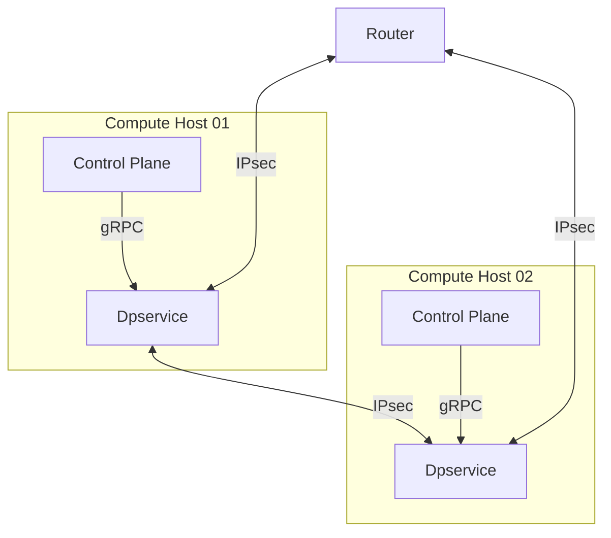

# IEP-24: Underlay Encryption - IPsec encryption between compute hosts

## Table of Contents

- [Summary](#summary)
- [Motivation](#motivation)
    - [Goals](#goals)
    - [Non-Goals](#non-goals)
- [Proposal](#proposal)
- [Alternatives](#alternatives)

## Summary

Implementation of an underlay encryption for the traffic between compute hosts. 
This touches the networking component dpservice in the first place.

## Motivation

Currently, the underlay network does not provide encryption. Applications are, however, free to apply encryption on the overlay network. 
In case applications are unable to communicate securely (for whatever reason), it would be desirable to offer underlay network encryption.
Regulatory requirements like BSI Grundschutz (see NET.1.1.A7 Absicherung von schützenswerten Informationen (B)) reflect the need for secure communication via secure protocols or secured network segments. 
Encryption of the underlay traffic in the right scope would thus make it possible to run software that cannot communicate securely itself and align with regulatory requirements.

### Goals

- Add the possibility to encrypt IPv6-encapsulated traffic between dpservice instances using IPsec Encapsulating Security Payload ([ESP](https://www.rfc-editor.org/info/rfc4303)) in transport mode

### Non-Goals

- This IEP does not handle the topic of key exchange. It is assumed that a symmetric key and salt will be made available to both 
  communication ends of a Security Association (SA). 

- The decision of whether to encrypt outgoing packets in dpservice will rely on a sound decision in the control plane. That means that when no encryption for a combination of underly IPv6 address and VNI is configured packets will be sent unencrypted.

- The option to offload encryption to the network card will be part of a subsequent enhancement.

## Proposal

### Related open issues

There are already 2 open issues related to this topic:

- https://github.com/ironcore-dev/metalnet/issues/320
- https://github.com/ironcore-dev/roadmap/issues/69

This IEP was a first draft that combined key exchange and encryption in one draft:
- https://github.com/ironcore-dev/enhancements/pull/38

### Overview:



### dpservice

The DPDK graph in dpservice has to be extended with encryption and decryption nodes. 
Those nodes shall use the IPSec implementation provided by [DPDK](https://doc.dpdk.org/guides/prog_guide/ipsec_lib.html). 
The library already provides the means for AES-256-GCM encryption/decryption as well as a SA database. 
It also handles sequence numbers to protect against replay attacks. 
The DPDK library will be configured to use ESP in transport mode for the single SAs. 
As there is already encapsulation and decapsulation in place, this will basically result in tunnel mode ESP.

Packets will be encrypted on the sender side after the IPv6-encapsulation and before the decapsulation on the receiver side. 
This ensures, that only traffic leaving/entering the physical host, will be encrypted and decrypted to avoid unnecessary packet processing overhead. 
A Security Association (SA) is created for each remote compute host, or rather remote dpservice instance, with which the local dpservice has to exchange packets. 
These SAs are stored in the DPDK SA database. 
The key as well as the salt (see [RFC4106](https://datatracker.ietf.org/doc/html/rfc4106)) for the encrypted connection is provided over the gRPC connection. 
Whenever a new key is pushed, a new SA gets created. Pushing a new key for an established SA will be used for key rotation.

It must be configurable to use encryption at all and which connections are to be encrypted per compute host or dpservice instance. That is, it must be possible to still use dpservice without any encryption and not enforce encrypted traffic once the feature is implemented. The general configuration (IPsec on/off) shall be a command line argument for the start of dpservice. The graph shall be unaltered if no IPsec is to be used. Configuring the single connections shall be possible via gRPC calls.

#### Scope of Encryption
As of now dpservice already sends IP-in-IPv6 packets in the underlay network. This shall not be changed at the moment. Rather it is intended to encrypt that encapsulated package as a whole. Following [RFC4303](https://www.rfc-editor.org/info/rfc4303/) (ESP in transport mode), the resulting package structure would be this:

```
| IPv6 Header | ESP Header | Inner IPv4 Package | ESP Trailer | ICV* |
<-------Unencrypted------->                                   <Unenc.>
               <---------------Authenticated------------------>
                            <-------------Encrypted----------->

*ICV - Integrity Check Value 
```

Using ESP introduces state to all connections.  
An SA fixes a method of encryption and the related key plus potential salt for each pair of communication partners. That information is identified by an SPI (Security Parameter Index) which is included in each packet. 
It is added by the sender when crafting the ESP header and read by the receiver to choose the matching key for decryption. 
The information about which connection to protect is stored in the Security Policy Database (SPD). The information on how to handle the protection is stored in the Security Association Database (SAD).   
When replay protection is required, the sequence numbers of each packet must be known on both sides. The sender needs to increment it one by one and the receiver needs to keep track of the last numbers to keep his replay window up to date. On the receiver side, this state cannot be rebuilt purely from the information contained in one or multiple packets. Making a stateful tracking of packets necessary for both communication ends.

In case statelessness is desired instead, [RFC4304 - 3.3.3](https://www.rfc-editor.org/info/rfc4303/#section-3.3.3) contains information on how ESP should be configured without replay protection. This configuration is on per SA basis, meaning that some SAs could be replay protected while others are not. DPDK's IPsec library allows enabling and disabling of sequence number checks via the [replay_win_sz](https://doc.dpdk.org/api/structrte__security__ipsec__xform.html#a85eb02412c31f7fbf81890c32a231b95). This makes it configurable whether this state should be built and maintained.

#### Impact on HA abilities
According to the [documentation](https://github.com/ironcore-dev/dpservice/blob/main/docs/ha/README.md), a running dpservice can have an HA failover instance running in active-standby. In order to avoid packet loss or interruptions in the failover case, a sync connection is in place to keep the already existing state of the active and the standby instance synchronized. The SPD as well as the SAD would need to be kept in sync as well as the single SAs. Without replay protection this should simply be the same gRPC calls to both instances as they would only need to care about the key material and SPI. With replay protection, however, the current sequence number would need to be maintained. Synchronizing each increment of an SA sequence number counter would be quite an overhead in synchronization traffic.

Hence, a possibly strategy would be working with batches of sequence numbers on the sending side. That is, the sender locks a range of n sequence numbers and shares that information with the standby instance (e.g. current range: 0,500). In case of a failover the standby node starts with the next range of packets. Larger sequence numbers should not be a problem for the general replay protection functionality.

On the receiving end, the standby node would need to know the last known sequence number. If it knows a lower one it is prone to replay attacks. The easiest approach would be starting at sequence number 0 which comes with the downside that any packet could be replayed. If the active instance synchronizes its last known sequence number only every x seconds or packets, the window of potential replay packets would be smaller. With that information the SAs on the standby instance could be kept up to date and a failover should work seamlessly.

If implementing this conflicts too much with the existing dpdk data structures, the HA ability will be bound to operation without replay protection. 

#### Key rotation
During key rotation there will need to be two SAs in place between a pair of compute hosts. The old one that shall be superseded and the new one.
The new one needs to be active on the receiver side before the sender can start sending with it. The old one needs to be in place on the receiver side for a grace period beginning with the moment when it is deleted from the sender side for as long as packets may still be on the wire. On the sender side, only one outgoing SA for one destination is needed at all times. Coordinating this is the responsibility of the control plane that handles the key management.

#### Hardware support
This IEP aims for the general functionality using software based cryptography in the first step. To do so, we will be using the cryptodevice, security and IPsec libraries in DPDK. Handling the protocol operations (i.e. inserting the ESP Header and Trailer as well as ICV) is done via DPDK's IPsec library functions. Doing the actual cryptography is done via a [software crypto device driver](https://doc.dpdk.org/guides/cryptodevs/openssl.html) that allows operations on ARM as well as x86 architectures. In the next steps specialized software device drivers (e.g. AES-NI), hardware crypto accelerators (e.g. Intel QAT) and SmartNICs/DPUs (e.g. Bluefield-2) shall be used for [lookaside or inline](https://doc.dpdk.org/guides/prog_guide/rte_security.html#design-principles) handling of crypto operations or the whole protocol.

### gRPC connection

We propose the following new endpoints for handling of the Security Associations:

```
//// IPSEC
// A Security Association is unidirectional. Underlay addresses are matched on their first
// 64 bits only, so one association covers a peer host rather than each of its addresses.
//
// These five fields name exactly one association. Which of them dpservice files it under
// depends on the direction - the vni for an egress association, the spi for an ingress one,
// because ipsec_encap cannot read an SPI off a packet that is not ESP yet - but a caller does
// not need to know that: every field given here is matched, and an association is only ever
// found under all five of them.
message SecurityAssociationId {
	uint32 vni = 1;            // the VNI whose traffic this association protects
	uint32 spi = 2;            // Security Parameter Index, as carried in the ESP header
	TrafficDirection direction = 3;
	bytes src_underlay = 4;    // source underlay address, as seen on the wire in this direction
	bytes dst_underlay = 5;    // destination underlay address, likewise
}


enum IpsecAlgorithm {
	AES_128_GCM = 0;
	AES_256_GCM = 1;
}

message CreateSecurityAssociationRequest {
	SecurityAssociationId id = 1;
	IpsecAlgorithm algorithm = 2;
	bytes key = 3;             // hex-encoded, length defined by the algorithm
	bytes salt = 4;            // hex-encoded, length defined by the algorithm
	// Anti-replay window, in packets, for an ingress association: how far a frame may be
	// reordered on the underlay before it is taken for a replay. Zero, which is also what an
	// omitted field means, disables replay checking entirely. An egress association has
	// nothing to check, so anything but zero is rejected there.
	uint32 replay_window = 5;
	// Extended sequence numbers (RFC 4304): the association counts to 2^64 rather than 2^32, with
	// only the lower half carried in the packet and the upper half authenticated along with it.
	// Both ends have to be created with the same value - it changes what the ICV covers, so a
	// mismatch fails every frame rather than degrading. Omitted means off, see ADR 0003.
	bool esn = 6;
}

message CreateSecurityAssociationResponse {
	Status status = 1;
}

message DeleteSecurityAssociationRequest {
	SecurityAssociationId id = 1;
}

message DeleteSecurityAssociationResponse {
	Status status = 1;
}

// Replace a live egress association with one built to these parameters, without ever leaving the
// traffic it protects unprotected: dpservice builds the replacement, then swaps it in between two
// packets. This is what makes rekeying gapless on the sending side; the receiving side needs no
// replacement, since several ingress associations can serve one VNI and peer at once.
//
// Egress only. An ingress association is filed under the SPI its frames carry, so it cannot be
// renumbered in place, and rotating its key in place would drop the frames still in flight under
// the old one - add a second ingress association instead and delete the old one once the peer has
// switched. See ADR 0006.
message UpdateSecurityAssociationRequest {
	// The association as it stands now, current wire SPI and all. Naming it by a SPI it no longer
	// carries replaces nothing, rather than replacing whatever took its place.
	SecurityAssociationId id = 1;
	uint32 new_spi = 2;        // what its ESP headers carry from here on
	// Everything below is what the association becomes, exactly as in a create: nothing is
	// carried over from the association being replaced, and an omitted field means its default
	// rather than what was there before.
	IpsecAlgorithm algorithm = 3;
	bytes key = 4;             // hex-encoded, length defined by the algorithm
	bytes salt = 5;            // hex-encoded, length defined by the algorithm
	uint32 replay_window = 6;  // egress has nothing to check, so anything but zero is rejected
	bool esn = 7;
	// NOTE: the replacement starts a sequence number of its own, so it needs key material this
	// association has not used before - reusing it would repeat an AES-GCM nonce.
}

message UpdateSecurityAssociationResponse {
	Status status = 1;
}

message GetSecurityAssociationRequest {
	SecurityAssociationId id = 1;
}

message GetSecurityAssociationResponse {
	Status status = 1;
	// The underlay addresses come back as matched, i.e. masked to the supported prefix length
	SecurityAssociationId id = 2;
	IpsecAlgorithm algorithm = 3;
	bytes key = 4;
	bytes salt = 5;
	uint32 replay_window = 6;
	bool esn = 7;
}

// Encryption is a property of an interface, not of the whole instance. It is symmetric: an
// encrypting interface neither sends nor accepts underlay traffic in the clear, so both ends
// of a tunnel have to agree or nothing passes between them.
//
// There is no single setter taking a bool on purpose. A proto3 scalar has no presence, so an
// omitted field would be indistinguishable from an explicit request to stop encrypting - and
// that is the one transition here that turns a protected endpoint into a cleartext one.
message EnableInterfaceEncryptionRequest {
	bytes interface_id = 1;
}

message EnableInterfaceEncryptionResponse {
	Status status = 1;
}

message DisableInterfaceEncryptionRequest {
	bytes interface_id = 1;
}

message DisableInterfaceEncryptionResponse {
	Status status = 1;
}

message GetInterfaceEncryptionRequest {
	bytes interface_id = 1;
}

message GetInterfaceEncryptionResponse {
	Status status = 1;
	bool encrypt = 2;
}

//// IPSEC
// Security Associations for the encrypted underlay tunnel, one per direction.
// Only available when dpservice was started with --enable-ipsec.
rpc CreateSecurityAssociation(CreateSecurityAssociationRequest) returns (CreateSecurityAssociationResponse) {}
rpc DeleteSecurityAssociation(DeleteSecurityAssociationRequest) returns (DeleteSecurityAssociationResponse) {}
rpc UpdateSecurityAssociation(UpdateSecurityAssociationRequest) returns (UpdateSecurityAssociationResponse) {}
rpc GetSecurityAssociation(GetSecurityAssociationRequest) returns (GetSecurityAssociationResponse) {}
// Per-interface encryption policy. Only available when dpservice was started with
// --enable-ipsec; the flag can also be set when the interface is created.
rpc EnableInterfaceEncryption(EnableInterfaceEncryptionRequest) returns (EnableInterfaceEncryptionResponse) {}
rpc DisableInterfaceEncryption(DisableInterfaceEncryptionRequest) returns (DisableInterfaceEncryptionResponse) {}
rpc GetInterfaceEncryption(GetInterfaceEncryptionRequest) returns (GetInterfaceEncryptionResponse) {}
```

The intended use of this would be to create a Security Association for the combination of a prefix of another dpservice and a VNI either for the egress (packet will be encrypted) or the ingress path (packet will be decrytpted). For the lifetime of the SA, the key and the salt are static and must match the lengths defined by the cipher suite.  
For key rotation of an ingress SA, a new SA would be added via the create call and after waiting for a grace period (for packets on the wire) the delete call can be used to delete the old SA. Handling this needs to be done by the control plane. The update endpoint can only be used for egress SAs as the sending side may change its key immediately and does not need to keep the old SA for a grace period. 

The SAs aim for the named combination of prefix and VNI. The configuration of which traffic is to be encrypted is made based on the interface packets are coming from or are sent to. This reflects the [Security Policy Database (SPD)](https://www.rfc-editor.org/info/rfc4301/#section-4.4.1) conceptionally.
Interfaces that are configured to be PROTECTED will only accept and send encrypted traffic. As each interface belongs to a VNI, the matching SA is found based on the VNI and the target underlay IPv6 prefix.

Setting the `replay_window_size` of an SA to 0 would fullfil the request of disabled replay protection. As this is a setting that is based on each SA it would need to be reissued for each SA creation.


## Alternatives

If one wanted to change the scope of the encryption, in order to be able to see the encapsulated IPv4 headers, it would in principle be possible to move the encrypt node in the graph in front of the encapsulate node. This way we'd end up with an encrypted IPv4 package with visible headers, that would then be encapsulated. As a diagram:

  ```
  | IPv6 Header | Inner IPv4 Header | ESP Header | Inner IPv4 Package | ESP Trailer | ICV |
  <----------Unencrypted----------->                                                <Unenc.>
                                     <---------------Authenticated------------------>
                                                  <------------Encrypted------------>
  
  ```
  Alternatively, the encryption node could stay at the same place and the inner IPv4 package could be encrypted using manual crypto operation structures or could be wrapped in a new message buffer structure to be handed to the DPDK IPsec implementation with less manual effort.  
  Reconfiguring the graph or node content for this would need to be done simultaneously for both communicating dpservices. 