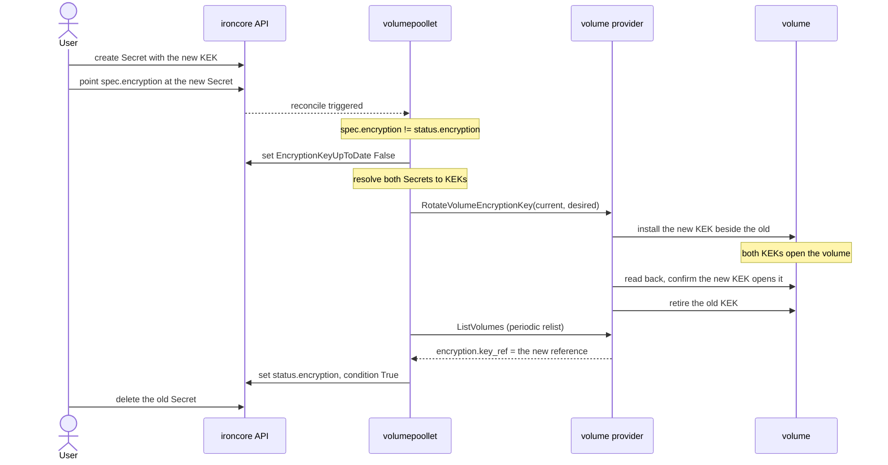
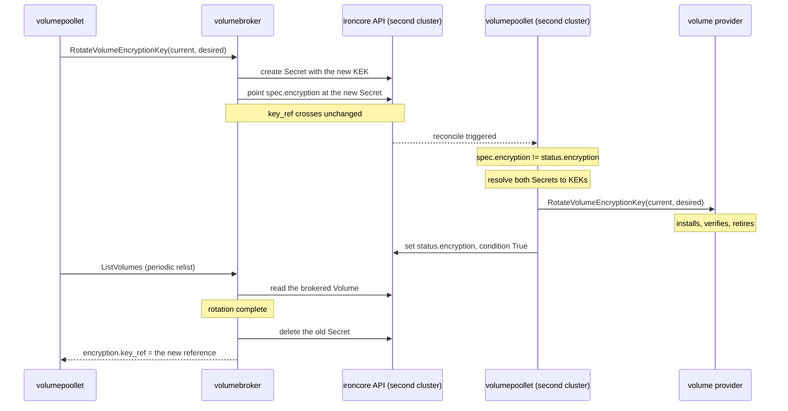

# IEP-TBD: Volume Encryption Key Rotation

## Table of Contents

- [Summary](#summary)
- [Motivation](#motivation)
  - [Goals](#goals)
  - [Non-Goals](#non-goals)
- [Proposal](#proposal)
  - [Volume API](#volume-api)
  - [Provider interface](#provider-interface)
  - [Pools backed by another ironcore cluster](#pools-backed-by-another-ironcore-cluster)
- [Alternatives considered](#alternatives-considered)
- [Open Questions](#open-questions)

## Summary

[IEP-6](06-storage-encryption.md) added volume encryption with a user-supplied key, and left rotation out of
scope. That key is fixed for the life of the volume.

This proposal makes `spec.encryption` mutable and reports in `status` the key reference currently in effect.
Rotating is pointing `spec.encryption` at a new `Secret`. `volumepoollet` compares `spec.encryption` with
`status.encryption`, and triggers the rotation in the volume provider.

## Motivation

**Key compromise.** A volume's encryption key can leak. It is stored in the API server and copied to
every host that runs the workload, so there is more than one way for the key to leak. Audits have a
control for key compromise. [BSI C5](https://www.bsi.bund.de/EN/Themen/Unternehmen-und-Organisationen/Informationen-und-Empfehlungen/Empfehlungen-nach-Angriffszielen/Cloud-Computing/Kriterienkatalog-C5/kriterienkatalog-c5_node.html),
the criteria catalogue German public-sector cloud use is assessed against, calls that control CRY-13,
"Handling of Compromised Keys". Other regimes have equivalents.

> The cloud service provider manages the use of compromised cryptographic keys to ensure they are only
> used in controlled circumstances and solely for decryption [...]

**Key lifecycle management.** C5 also asks for detailed records of each key from creation to destruction,
including any status changes (CRY-17.02B). Today no such record is accessible through the ironcore API.

**Why this needs an API change.** Replacing a key today means replacing the volume. `spec.encryption` is
immutable, so the only route is to create a second `Volume` with the new key, copy the data across, and
delete the original. That takes the workload down for as long as the copy runs, needs room for a second copy
of the data, and leaves the compromised key opening the data until the original `Volume` is gone.

### Goals

- Replace a `Volume`'s encryption key while the `Volume` stays attached and its workload keeps running.
- Make the previous key unusable on the `Volume`, once the replacement is proven to work.
- Make a rotation observable on the `Volume`: what was asked for, and what is actually in effect.
- Keep the key user-supplied.

### Non-Goals

- Rotating the key of a `VolumeSnapshot`.
- Key sources other than a Kubernetes `Secret`. A follow-up IEP proposes KMS-backed sources.
- Re-encrypting volume data, or cryptographic erasure.
- Owning a rotation schedule or policy.

## Proposal

Two keys are involved, and only one of them rotates. The rest of this document uses these two names.

- **DEK**, the data encryption key. librbd creates it, keeps it inside the LUKS header at the front of the
  RBD image, and encrypts the disk data with it. No ironcore component ever sees the DEK, and a rotation
  never touches it.
- **KEK**, the key encryption key. 32 bytes supplied by the user, which unlock the DEK. The user puts the KEK in
  a `Secret`, and `spec.encryption` names that `Secret`. The KEK is what rotates.

### Volume API

A `Volume` that has never rotated:

```yaml
spec:
  encryption:
    secretRef:
      name: encryption-key-secret
status:
  state: Available
  encryption:
    secretRef:
      name: encryption-key-secret
  conditions:
  - type: EncryptionKeyUpToDate
    status: "True"
```

To rotate, create a `Secret` holding the new KEK and point the `Volume` at that `Secret`. The new `Secret` has
the same shape IEP-6 defined, with the KEK under `encryptionKey`. While the rotation runs, `status` still
names the KEK in effect:

```yaml
spec:
  encryption:
    secretRef:
      name: encryption-key-secret-2      # changed
status:
  state: Available                       # unchanged; the volume still works
  encryption:
    secretRef:
      name: encryption-key-secret        # still the KEK in effect
  conditions:
  - type: EncryptionKeyUpToDate
    status: "False"
    reason: RotationInProgress
```

The provider sets `status.encryption` once it has verified the new KEK opens the volume, and the condition
returns to `True`. The user then deletes the old `Secret`, removing the last stored copy of the retired KEK.
The old `Secret` must exist until the rotation completes, because the provider needs the old KEK to install
the new KEK.

The KEK reference is the only part of `spec.encryption` that may change. Encryption cannot be enabled on an
unencrypted `Volume`, or disabled on an encrypted `Volume`.



`volumepoollet` drives the rotation. When `spec.encryption` and `status.encryption` differ, `volumepoollet`
resolves both `Secret`s, sends both KEKs to the provider, and writes back what the provider reports.

`machinepoollet` changes in two ways. It resolves the attach KEK from `status.encryption` rather than
`spec.encryption`, so an attach during a rotation gets the KEK currently in effect. And it treats a KEK change
as an in-place volume update, the way a resize is handled today.

A machine whose volume is rotating is unaffected. The machine holds the DEK, which a rotation does not change.

### Provider interface

These are the changes the API change forces on IRI, the interface between the poollets and the providers.

```diff
 // iri/apis/volume/v1alpha1/api.proto
 service VolumeRuntime {
   rpc CreateVolume(CreateVolumeRequest) returns (CreateVolumeResponse) {};
   rpc ExpandVolume(ExpandVolumeRequest) returns (ExpandVolumeResponse) {};
+  rpc RotateVolumeEncryptionKey(RotateVolumeEncryptionKeyRequest)
+      returns (RotateVolumeEncryptionKeyResponse) {};
 }

+message RotateVolumeEncryptionKeyRequest {
+  string volume_id = 1;
+  EncryptionSpec current = 2;
+  EncryptionSpec desired = 3;
+}
+
+message RotateVolumeEncryptionKeyResponse {}
+
 message EncryptionSpec {
   map<string, bytes> secret_data = 1;
+  KeyRef key_ref = 2;
 }

+message KeyRef {
+  string secret_name = 1;
+}
+
+message EncryptionStatus {
+  // the KEK the provider has installed and verified, reported by ListVolumes
+  KeyRef key_ref = 1;
+}
+
 message VolumeStatus {
   VolumeState state = 1;
   VolumeAccess access = 2;
   VolumeResources resources = 3;
+  EncryptionStatus encryption = 4;
 }
```

### Pools backed by another ironcore cluster

A `VolumePool` can be backed by a second ironcore cluster instead of by storage hardware.
[`volumebroker`](https://github.com/ironcore-dev/ironcore/tree/288a2b0950a30b0a8e4d3a1574628428bdd16d49/broker/volumebroker)
does that. It is a sidecar in the client cluster that proxies the provider interface into the second cluster.

Because a broker is a proxy, the same IRI method defined above will be used for broker key rotation. The
rotation just happens twice, once in each cluster.



## Alternatives considered

**A job-style rotation resource.** Rotation is requested by creating an object rather than by moving the
reference on the `Volume`. [csi-addons](https://github.com/csi-addons/kubernetes-csi-addons) uses that
shape for `ceph-csi`:

```yaml
apiVersion: storage.ironcore.dev/v1alpha1
kind: VolumeEncryptionKeyRotation
metadata:
  name: rotate-db-primary
spec:
  volumeRef:
    name: db-primary
  secretRef:
    name: encryption-key-secret-2
status:
  state: Succeeded
```

A rotation resource still needs the same mutable `spec.encryption` and the same IRI method, because something
has to point the `Volume` at the new `Secret` once the rotation succeeds. What a rotation resource replaces is
`status.encryption`: progress lives on the rotation object instead. So the `Volume` can only answer which KEK
it is on while that object is kept, and a controller ends up writing to `spec` rather than to `status`.

A rotation resource and a mutable `spec.encryption` can both work. This proposal picks the mutable
`spec.encryption`, which fits the style of the rest of the ironcore API.

## Open Questions

**What is the current state and plan for volume encryption on snapshots and through the CSI driver, and
should this proposal take them into account?**

- A `Volume` restored from an encrypted snapshot has no `spec.encryption` of its own, and uses the KEK of
  the volume the snapshot came from.
- `ironcore-csi-driver` has no encryption support.
