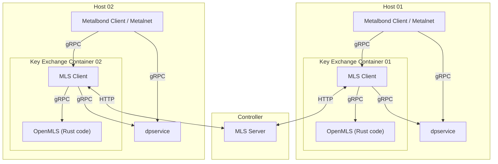
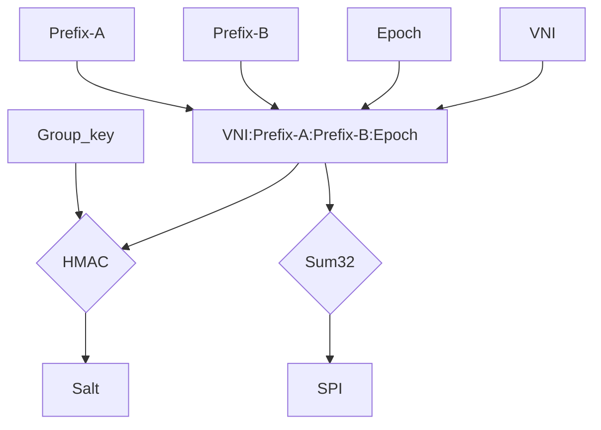

# IEP-25: Underlay Encryption - Key Exchange

## Table of Contents

- [Summary](#summary)
- [Motivation](#motivation)
    - [Goals](#goals)
    - [Non-Goals](#non-goals)
- [Proposal](#proposal)
- [Future enhancements and changes](#future-enhancements-and-changes)
- [Alternatives](#alternatives)

## Summary

Implementation of a key exchange between hosts to provide keys for the underlay encryption of PR https://github.com/ironcore-dev/enhancements/pull/50.

## Motivation

To provide keys for the underlay encryption in dpservice, symmetric keys and all other necessary information have to be shared between hosts with dpservice.

### Goals

- Couple key exchange only to Metalbond without deep integration into Metalnet, to also support hosts without Metalnet
- Using the MLS protocol for the first variant for the key exchange, with OpenMLS as specific implementation of this protocol
- One MLS group/key per VNI
- Make it very independent from the source code of Metalbond and Metalnet to be easily replaceable by other key-exchange solutions in the future
- Attach it to the new gRPC endpoints introduced by IEP https://github.com/ironcore-dev/enhancements/pull/50

### Non-Goals

## Proposal

### Related previous issues and PRs

There are already 2 open issues related to this topic:

- https://github.com/ironcore-dev/metalnet/issues/320
- https://github.com/ironcore-dev/roadmap/issues/69

There was also a first version for an enhancement document for the underlay encryption:

- https://github.com/ironcore-dev/enhancements/pull/38

This was closed, because as a result of the community discussion, the originally intended use of IKEv2 was replaced by MLS. Additionally, it was decided to split it into 2 smaller enhancement proposals.

### Selected protocol

In the [previous PR](https://github.com/ironcore-dev/enhancements/pull/38) there was a discussion about the method, 
how to share the key for the encryption. 
In the end the conclusion was to use MLS (<https://datatracker.ietf.org/doc/rfc9420/>) as first implementation, instead of IKEv2.

The [OpenMLS](https://github.com/openmls/openmls) library is so far the best maintained implementation of the MLS protocol, so it is used for this first version of the underlay encryption. 
Because OpenMLS is written in Rust, a small glue layer has to be implemented to expose the necessary functions to the Go code. 

### Overview

To avoid a new CRD for the SA (Security Association) as well as a resulting CR for each connection and because it also has to work on hosts without Metalnet, 
the key exchange will be initiated by the existing Metalbond workflows but happen on its own dedicated channel.
The MLS protocol differs quite a lot from the Metalbond protocol. 
It would be a very big change to modify the Metalbond protocol with MLS-specific extensions to make all MLS traffic possible over it. 
This would result into a hard commitment for the MLS protocol for the future. 
To avoid this problem of MLS-specific modifications, the MLS traffic will be handled by a second parallel HTTP connection with a MLS server next to the Metalbond server. 

OpenMLS is written in Rust. Both communicate with a gRPC connection. The Go code handles the orchestration 
(subscriptions, key rotation, ...) and the Rust code is just a wrapper for the OpenMLS and handles only the MLS groups and members, 
based on the messages coming from the Go code. 

MLS groups are created per VNI. The first one, who subscribes to a VNI, also creates the group for it. Everyone, who subscribes afterwards to the VNI, is automatically invited into the group and receives the group key.
Individual Security Associations (SAs) are then formed between hosts for each combination of VNI and target address prefix. Since a host may serve multiple specific underlay target addresses within the same VNI, the assocation relation is simplified to the address prefixes of the hosts, which bundles addresses belonging to the same host address prefix and VNI into a single SA.

When subscribing to a VNI, the host also uploads its address prefix to the MLS server. In case a host joins a group or gets a group update for later joined members, this host receives all address prefixes from the MLS server, which are attached to the group. 
For each pair of hosts, involving a host itself, an SPI is derived on that host by combining the host's prefix with the individual target prefix and the epoch of the MLS group.
To ensure that the derivation leads to the same SPI on both of the involved hosts comprising a pair, each pair of prefixes are numerically sorted beforehand.
Additionally, each of the prefix pair and epoch combinations is then passed together with the group key into an HMAC function to derive the salt for the specific pair.
Because the addresses are pairwise numerically sorted and because each host knows his own prefix address, 
every connection pair of two hosts is capable of independently deriving the identical SPI and salt for their specific connection.
To make this work, each host must have a unique address prefix in the underlay network.

All key exchange related parts are separated from the Metalbond and Metalnet code by a minimal gRPC connection. This makes it exchangeable more easily.

The periodical key rotation is only done internally without any intervention from the outside by Metalbond or Metalnet. 
The MLS server triggers the key rotation and ensures, that all clients on the hosts of the group are in sync, 
to avoid deleting an outdated key before every client received the new one. 
A key rotation always results in a new salt and SPI too.

In case of a reboot or crash, the entire state of the MLS-server will be reset and the whole group creation is started from the beginning with new key-packages from each client. 
Because each group is created from a new key-package coming, even with the epoch starting a 0 again, the group keys and derived salt values will be different. 
The salt is derived with HMAC with the group key as input. So a different group key automatically results in a different salt too.
That way a reuse of the same key or salt will never happen.
A second parallel MLS-server is not in the scope of this proposal, but because key-packages of the clients are only used 1 time each, 
the second MLS-server would get different key-packages and so also create different group keys and salts, than the first MLS-server.

### MLS Client gRPC API for key exchange

The following describes the API of the MLS Client, which Metalnet will connect to in order to control the key exchange.

| RPC Method | Request Parameters | Response |
| --- | --- | --- |
| **`Init`** | `client_name` (str) `ip_prefix` (str) | *(Empty)* |
| **`Subscribe`** | `vni` (uint32) | *(Empty)* |
| **`Unsubscribe`** | `vni` (uint32) | *(Empty)* |
| **`IsKeyReady`** | `vni` (uint32) | `is_ready` (bool) |

- `Init`: Initializing it for the host. In the context of MLS this means creating an initial set of key packages and starting to listen to the MLS server connections. The `client_name` can be the name of the host and is only for better identification when debugging and has no functional purpose for the key exchange. The `ip_prefix` is the prefix of the IP addresses of the host in the IPv6 underlay network. Different hosts must have a different prefix.

- `Subscribe`: Similar to Metalbond, it subscribes at the MLS server to a specific VNI, in order to get an inviation to the MLS group linked to the VNI. The first host, that subscribes for a VNI, also creates the MLS group for the VNI.

- `Unsubscribe`: Leave the MLS group for the specified VNI.

- `IsKeyReady`: Returns true, after the key exchange client has delivered the group key for the VNI to the dpservice. This is only done for the initial setup, to ensure, that the route is only created after the key is ready in dpservice.

### Metalnet

Metalnet requires a new bool property in the Network CR to tell whether the network has to be encrypted or not. 
There are no further changes in Metalnet to be able to run the key exchange on hosts, where only Metalbond is running without Metalnet.

## Future enhancements and changes

This is list of possible future enhancements, which are not part of the current proposal:

- TLS encryption

    The data transfer with the MLS server is done unencrypted at the moment. 
    The keys are provided and secured by the MLS. So the information shared with the server are not critical, 
    but it would be a security advantage, if the connection is encrypted too with TLS. Beside this there is the problem, 
    that everyone can subscribe to the server for any VNI and can be part of any group. 
    With TLS the hosts can be validated based on their certificates.

- Netlink support

    The current proposal only supports dpservice-enabled hosts. For nodes without dpservice, Metalbond has support for route creation via netlink, for example on a router.
    This is not part of the current proposal and could be added in a later version and a new proposal.

- Redundant MLS-server

    Currently there is only 1 MLS-server at a time. A handling for a redundant server has to be added in a new proposal.

## Alternatives

- Encapsulate the key exchange into a Kubernetes operator. 
  This operator would watch the network and network interface CR's and update a new status field, 
  when the key is delivered to dpservice. This eliminates the gRPC connection between the Metalbond and the key exchange MLS client. 
  This would make it necessary, that there is a Metalnet available on the same host. 
  So on hosts, where only a Metalbond client is running without Metalnet, this new operator wouldn't work.

- Use a Go-native MLS implementation like https://github.com/thomas-vilte/mls-go or https://github.com/trevex/mls-go 
  instead of the OpenMLS Rust implementation. This would eliminate the internal gRPC connection between the Go and the Rust code. 
  However, these repositories seem to be much less actively maintained than OpenMLS.
