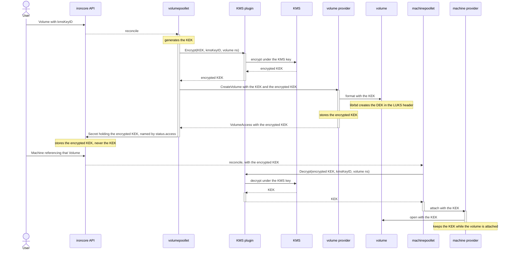

# IEP-TBD: KMS-backed Volume Encryption Keys

## Table of Contents

- [Summary](#summary)
- [Motivation](#motivation)
  - [Goals](#goals)
  - [Non-Goals](#non-goals)
- [Proposal](#proposal)
  - [Volume API](#volume-api)
  - [KMS plugin](#kms-plugin)
  - [Getting the KEK to a provider](#getting-the-kek-to-a-provider)
  - [Installing a plugin](#installing-a-plugin)
  - [Pools backed by another ironcore cluster](#pools-backed-by-another-ironcore-cluster)
- [Alternatives considered](#alternatives-considered)

## Summary

[IEP-6](06-storage-encryption.md) added volume encryption with a user-supplied key, held in a `Secret` in
the ironcore API server, and listed KMS support as a non-goal. A `Secret` is still the only place a
`Volume` can name its key.

This proposal lets a `Volume` refer to a key held in an external key management system instead. A plugin
outside ironcore turns that reference into the key the volume needs. No KMS backend implementation enters
the repository.

## Motivation

**To encrypt a volume, a user has to give ironcore the key.** It is stored in an ordinary `Secret`, so it
lands in the API server's database and in every backup of that database. Holding other people's keys makes
ironcore a key store, and a key store is the component an audit expects to be certified. [BSI
C5](https://www.bsi.bund.de/EN/Themen/Unternehmen-und-Organisationen/Informationen-und-Empfehlungen/Empfehlungen-nach-Angriffszielen/Cloud-Computing/Kriterienkatalog-C5/kriterienkatalog-c5_node.html),
the BSI criteria catalogue for cloud services, asks for the opposite in CRY-10.01B:

> [...] ensuring separation of the key management system from the application and middleware layers [...]

A KMS the user trusts should hold that key, or hold the key that encrypts it. Either way ironcore stops being
the key store.

**Why this needs an API change.** `spec.encryption` has one field and it is a `Secret` reference, so the
only key a `Volume` can name is one that has been copied into ironcore.

### Goals

- Let a user keep the key for an encrypted `Volume` in a KMS they trust.
- Keep that key out of the ironcore API server.
- Require the KMS on every create and every attach, so that revoking access there stops both.
- Keep KMS backend implementations out of ironcore.
- Keep `secretRef` working as it does today.

### Non-Goals

- KMS backend implementations in the ironcore repository.
- A KMS supplied by a user rather than configured by the operator.
- Encryption through `ironcore-csi-driver`.

## Proposal

Three keys are involved. The rest of this document uses these three names.

- **DEK**, the data encryption key. librbd creates it, keeps it inside the LUKS header at the front of the
  RBD image, and encrypts the disk data with it. No ironcore code ever handles it.
- **KEK**, the key encryption key, which unlocks the DEK. With `secretRef` the user supplies it in a `Secret`
  under `encryptionKey`. With a KMS key `volumepoollet` generates it.
- **KMS key**, the user's own key inside an external KMS, never stored in the ironcore API server. It
  encrypts and decrypts the KEK.

### Volume API

Today a `Volume` names the `Secret` that holds the KEK. This proposal does not change that:

```yaml
spec:
  encryption:
    secretRef:
      name: encryption-key-secret
```

A `Volume` may refer to a KMS key instead:

```yaml
spec:
  encryption:
    kmsID: vault-a                                              # optional, picks one of several KMSes
    kmsKeyID: vault://team-a/volume-keys/db-primary?version=3   # mutually exclusive with secretRef
status:
  state: Available
  access:
    # the KMS encrypts the KEK, and the encrypted KEK is stored in this Secret
    # under encryptedKey, beside the ceph credentials it holds today
    secretRef:
      name: db-primary-a1b2c3
  # status.encryption and EncryptionKeyUpToDate come from the key rotation proposal
  encryption:
    kmsID: vault-a
    kmsKeyID: vault://team-a/volume-keys/db-primary?version=3
  conditions:
  - type: EncryptionKeyUpToDate
    status: "True"
```

`kmsKeyID` is an opaque string that only the KMS interprets. ironcore compares two references for equality and
never looks inside one.

An existing volume encrypted with a `Secret` can be moved to a KMS key. ironcore handles that as an ordinary
key rotation, which the [key rotation proposal](24-volume-encryption-key-rotation.md) describes.

Some KMS services never return a key, and only encrypt or decrypt a payload. So the KMS encrypts the KEK and
ironcore stores only that. An encrypted KEK cannot open a volume if it leaks. Rotating the KMS key
re-encrypts it, with no provider involved.

### KMS plugin

A third-party KMS can provide two kinds of API: a **key-retrieval** API, which returns the key, and a
**key-wrapping** API, which encrypts and decrypts data with the key and never returns it. Most services
support both, Vault among them, but some are key-wrapping only, such as AWS KMS or a hardware security
module.

The plugin interface takes the key-wrapping shape. Its concrete form comes from the
[Kubernetes KMS v2 provider contract](https://github.com/kubernetes/kubernetes/blob/master/staging/src/k8s.io/kms/apis/v2/api.proto):

```proto
// kms/v1alpha1
service KeyManagementService {
  rpc Encrypt(EncryptRequest) returns (EncryptResponse) {};
  rpc Decrypt(DecryptRequest) returns (DecryptResponse) {};
}

message EncryptRequest {
  // the KEK
  bytes plaintext = 1;
  // the kmsKeyID from the Volume, verbatim
  string key_id = 2;
  // the Kubernetes namespace of that Volume, so a plugin serving more than one
  // namespace can refuse a key_id that does not belong to that namespace
  string volume_namespace = 3;
}

message EncryptResponse {
  // the encrypted KEK
  bytes ciphertext = 1;
}

message DecryptRequest {
  bytes ciphertext = 1;
  string key_id = 2;
  string volume_namespace = 3;
}

message DecryptResponse {
  bytes plaintext = 1;
}
```

This plugin interface should cover all KMS services. If a KMS service can only return the key, then the plugin
can expose `Decrypt` by fetching that key and decrypting the payload itself. If the plugin returned the key
instead, then it would be impossible to cover a key-wrapping KMS.

### Getting the KEK to a provider

librbd takes the KEK as a parameter:

```c
// src/include/rbd/librbd.h
typedef struct {
  rbd_encryption_algorithm_t alg;
  const char* passphrase;
  size_t passphrase_size;
} rbd_encryption_luks2_format_options_t;
```

There is no key id and no callback, so the plaintext KEK has to be present in the process that opens the
image. That is ceph-provider when it writes the LUKS header, and QEMU's librbd on every attach. So a provider
cannot be handed the encrypted KEK in place of the KEK.

So a poollet decrypts the KEK and hands the plaintext to the provider it calls:



### Installing a plugin

The operator installs the plugins and names them. A user selects one by name and never supplies one.

The plugins run beside the poollets and are reached over unix sockets. One set runs next to
`volumepoollet`. One runs on every hypervisor, next to `machinepoollet`.

Each poollet takes one named endpoint per KMS:

```
--kms-endpoint=vault-a=unix:///var/run/ironcore/kms-vault-a.sock
--kms-endpoint=vault-b=unix:///var/run/ironcore/kms-vault-b.sock
```

A `kmsID` that `volumepoollet` has no endpoint for leaves the volume unprovisioned, the way a missing `Secret`
does today. The names have to agree across every poollet that may serve a volume, because a machine can
schedule onto any hypervisor.

Filesystem permissions on a socket decide who may call the plugin behind that socket. The `volume_namespace`
in the request lets a plugin refuse a `key_id` that does not belong to that namespace.

The operator gives each plugin a credential that can reach every key any volume that poollet serves may name.

### Pools backed by another ironcore cluster

A pool can be backed by a second ironcore cluster instead of by storage hardware.
[`volumebroker` and `machinebroker`](https://github.com/ironcore-dev/ironcore/tree/288a2b0950a30b0a8e4d3a1574628428bdd16d49/broker)
do that. They are sidecars in the client cluster that proxy the provider interface into the second cluster.

A broker already copies the key reference and the encrypted KEK today, so to make this work every cluster
involved needs a KMS plugin under the same name, pointing at the same KMS instance. Because a broker is a
proxy, the second cluster is the one that calls `Decrypt`.

Two things are missing for that to work. The reference cannot name a KMS key yet, and the machine side has no
reference field at all:

```diff
 // iri/apis/volume/v1alpha1/api.proto
 // KeyRef comes from the key rotation proposal
 message KeyRef {
   string secret_name = 1;
+  KMSKey kms = 2;
 }

+message KMSKey {
+  string id = 1;        // the kmsID from the Volume
+  string key_id = 2;    // the kmsKeyID from the Volume, verbatim
+}
```

```diff
 // iri/apis/machine/v1alpha1/api.proto
 message VolumeConnection {
   map<string, bytes> encryption_data = 5;
   int64 effective_storage_bytes = 6;
+  KeyRef key_ref = 7;
 }
```

`KeyRef` is declared in both the volume and machine packages, as the volume and machine runtimes already
declare their encryption fields separately.

A volume provider stores `key_ref` and reports it back, as the key rotation proposal already specifies.

## Alternatives considered

**A key-retrieval plugin interface.** The plugin returns the key instead of encrypting a payload. The KMS then
takes the place of the `Secret`, and nothing stores an encrypted KEK. That is simpler. Two reasons rule it
out. A key-retrieval plugin cannot serve a KMS that only wraps keys, so those services would be out of scope.
A key-retrieval plugin also takes the user's key out of the KMS. ironcore does not store that key, but it has
direct access to it. That makes ironcore subject to higher security requirements and audit.

**Encryption at rest on the ironcore API server.** A Kubernetes apiserver encrypts stored resources through
[`EncryptionConfiguration`](https://kubernetes.io/docs/tasks/administer-cluster/kms-provider/), using the same
KMS v2 plugin contract this proposal follows. That protects etcd and is worth doing. But it is not bring your
own key. The key is the operator's, one per apiserver rather than one per `Volume`, so a user cannot name a
key of their own. The apiserver also decrypts on read, so anything with RBAC to read the `Secret` still gets
the KEK in plaintext.

**A controller that copies the KEK out of the KMS into a `Secret`.** The
[External Secrets Operator](https://github.com/external-secrets/external-secrets) does this today, and it
needs no ironcore change at all. Two things rule it out. The KEK comes to rest in the API server, which is
what this proposal removes. And the controller may refresh that `Secret` in place. `spec.encryption` does not
change then, but the KEK behind it does, so ironcore cannot tell that the KEK was replaced.
