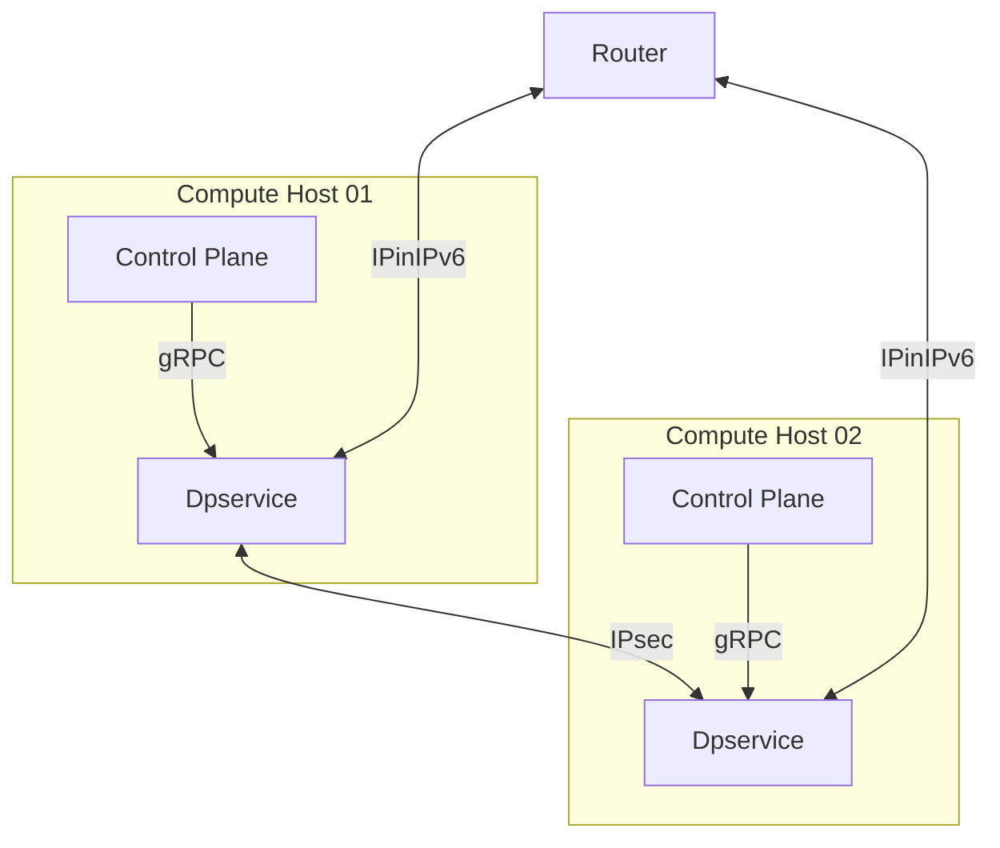

# IEP-NNNN: Underlay Encryption - IPsec encryption between compute hosts

## Table of Contents

- [Summary](#summary)
- [Motivation](#motivation)
    - [Goals](#goals)
    - [Non-Goals](#non-goals)
- [Proposal](#proposal)
- [Alternatives](#alternatives)

## Summary

Implementation of an underlay encryption for the traffic between compute hosts. 
This touches on the networking component dpservice in the first place. In further iterations it also touches instances that use the Linux kernel for their networking.

## Motivation

Currently, the underlay network does not provide encryption. 
However, to align with regulatory requirements for specific security domains (for example as mandated by the BSI), encryption is necessary. 
Once enabled, all underlay traffic originating from dpservice instances must be encrypted to ensure data confidentiality and integrity.

### Goals

- Add the possibility to encrypt IPv6-encapsulated traffic between dpservice instances using IPsec Encapsulating Security Payload ([ESP](https://www.rfc-editor.org/info/rfc4303)) in transport mode

### Non-Goals

- This IEP does not handle the topic of key exchange. It is assumed that a symmetric key and salt will be made available to both 
  communication ends of a Security Association. 

- The decision of whether to encrypt outgoing packets in dpservice will rely on a sound decision in the control plane. That means that when no encryption for a combination of underly IPv6 address and VNI is configured packets will be sent unencrypted.

- The option to offload encryption to the network card will be part of a subsequent enhancement.

- This IEP aims for East-West traffic encryption between compute hosts running dpservice. North-South traffic between compute hosts and routers will not be encrypted and thus routers will not be in the focus. However, all changes made here shall avoid complications with future integration with the Linux kernel XFRM interface.

## Proposal

### Related open issues

There are already 2 open issues related to this topic:

- https://github.com/ironcore-dev/metalnet/issues/320
- https://github.com/ironcore-dev/roadmap/issues/69

This IEP was a first draft that combined key exchange and encryption in one draft:
- https://github.com/ironcore-dev/enhancements/pull/38

### Overview:



### dpservice

The DPDK graph in dpservice has to be extended with encryption and decryption nodes. 
Those nodes shall use the IPSec implementation provided by [DPDK](https://doc.dpdk.org/guides/prog_guide/ipsec_lib.html). 
The library already provides the means for AES-256-GCM encryption/decryption as well as a SA database. 
It also handles sequence numbers to protect against replay attacks. 
The DPDK library will be configured to use ESP in transport mode for the single SAs. 
As there is already encapsulation and decapsulation in place, this will basically result in tunnel mode ESP.

Packets will be encrypted on the sender side after the IPv6-encapsulation and before the decapsulation on the receiver side. 
This ensures, that only traffic leaving/entering the physical host, will be encrypted and decrypted to avoid unnecessary packet processing overhead. 
An SA is created for each remote compute host, or rather remote dpservice instance, with which the local dpservice has to exchange packets. 
These SAs are stored in the DPDK SA database. 
The key as well as the salt (see [RFC4106](https://datatracker.ietf.org/doc/html/rfc4106)) for the encrypted connection is provided over the gRPC connection. 
Whenever a new key is pushed, a new SA gets created. Pushing a new key for an established SA will be used for key rotation.

For backwards compatibility the encryption must be configurable for each pair of compute hosts. That is, as long as a route to another compute host is configured without an SA, the traffic will further be unencrypted until encryption is enabled.

#### Scope of Encryption
As of now dpservice already sends IP-in-IPv6 packets in the underlay network. This shall not be changed at the moment. Rather we intend to encrypt that encapsulated package as a whole. Following [RFC4303](https://www.rfc-editor.org/info/rfc4303/) (ESP in transport mode), the resulting package structure would be this:

```
| IPv6 Header | ESP Header | Inner IPv4 Package | ESP Trailer | ICV* |
<-------Unencrypted------->                                   <Unenc.>
               <---------------Authenticated------------------>
                            <-------------Encrypted----------->

*ICV - Integrity Check Value 
```

#### Key rotation
During key rotation there will need to be two SAs in place between a pair of compute hosts. The old one that shall be superseded and the new one.
The new one needs to be active on the receiver side before the sender can start sending with it. The old one needs to be in place on the receiver side for a grace period beginning with the moment when it is deleted from the sender side for as long as packets may still be on the wire. Coordinating this is the responsibility of the control plane that handles the key management.

#### Hardware support
This first IEP aims for the general functionality using software based cryptography in the first step. To do so, we will be using the cryptodevice, security and IPsec libraries in DPDK. Handling the protocol operations (i.e. inserting the ESP Header and Trailer as well as ICV) is done via DPDK's IPsec library functions. Doing the actual cryptography is done via a [software crypto device](https://doc.dpdk.org/guides/cryptodevs/aesni_mb.html) to make use of crypto instructions (AES-NI). In the next steps hardware crypto accelerators (e.g. Intel QAT) and SmartNICs/DPUs (e.g. Bluefield-2) shall be used for [lookaside or inline](https://doc.dpdk.org/guides/prog_guide/rte_security.html#design-principles) handling of crypto operations or the whole protocol.

### gRPC connection

We propose new endpoints for handling of the Security Associations with functionalities Create and Delete.

Create Security Association 
- Needs:
  - SPI
  - Direction: Incoming/Outgoing
  - Encryption:
    - Algorithm - will start only with AES-GCM-256
    - Key
    - Salt
  - Traffic selector:
    - VNI
    - Source or Destination IPv6 Address (depends on Direction)
- Is used to create a new Security Association between two endpoints

Delete Security Association
- Needs:
  - SPI
- Is used to remove a Security Association 

The create endpoint will be used for key rotation as well. 
As each key rotation also creates a new SA with new SPI, key and salt, there is no explicit reason to have an update endpoint. Especially since the key rotation is to be managed by the control plane, an endpoint that suggest that dpservice handles the rotation could be misleading. 
In order to handle the three policy options (or [processing choices](https://www.rfc-editor.org/info/rfc4301/#section-4.4.1)) DISCARD, BYPASS and PROTECT, needed especially in the case of outgoing traffic, a create call without a key would suffice to create a BYPASS policy to send traffic unencrypted. A create call with a key would change the policy to PROTECT. The default would be DISCARD, so packages to a destination IP/VNI combination that hasn't been configured yet, would simply be dropped.

## Alternatives

- If no encryption is required, the additional graph nodes could simply be left out of the graph. However, since the graph creation relies on preprocessor commands, the configuration is fixed at compile time. It is possible to simply skip the operation of the nodes with application runtime configuration but the nodes would still be part of the graph. The "feature arc" functionality of the graph library seems to bridge that gap but it is still handled as experimental in the [documentation](https://doc.dpdk.org/api/rte__graph__feature__arc_8h.html) and apparently it comes with a performance impact even if the feature is not used ([DPDK summit presentation](https://youtu.be/AENsTjL_6eA?list=PLo97Rhbj4ceI3ENbGEN44mBVkLtdYB0DC&t=1493)).

- If one wanted to change the scope of the encryption, in order to be able to see the encapped IPv4 headers, for example, it would in principle be possible to move the encrypt node in the graph in front of the encapsulate node. This way we'd end up with an encrypted IPv4 package with visible headers, that would then be encapped. I.e.:

  ```
  | IPv6 Header | Inner IPv4 Header | ESP Header | Inner IPv4 Package | ESP Trailer | ICV |
  <----------Unencrypted----------->                                                <Unenc.>
                                     <---------------Authenticated------------------>
                                                  <------------Encrypted------------>
  
  ```
  Reconfiguring the graph for this would need to be done simultaneously for both communicating dpservices. For the same reasons as listed in the last bullet point, this is something that would be a candidate for the feature arc functionality of the graph library or something that needs custom compile time/runtime configuration.

- Instead of adding encryption as an extra node after encapsulation (and vice versa with decryption/decapsulation), the DPDK IPsec library's tunnel mode ESP could be explored and the nodes could be merged. This would mean to use NULL encryption algorithm (i.e. no encryption) as long as a route is supposed to be unencrypted. It would also mean not just to attach new nodes but change existing ones to a larger degree. 