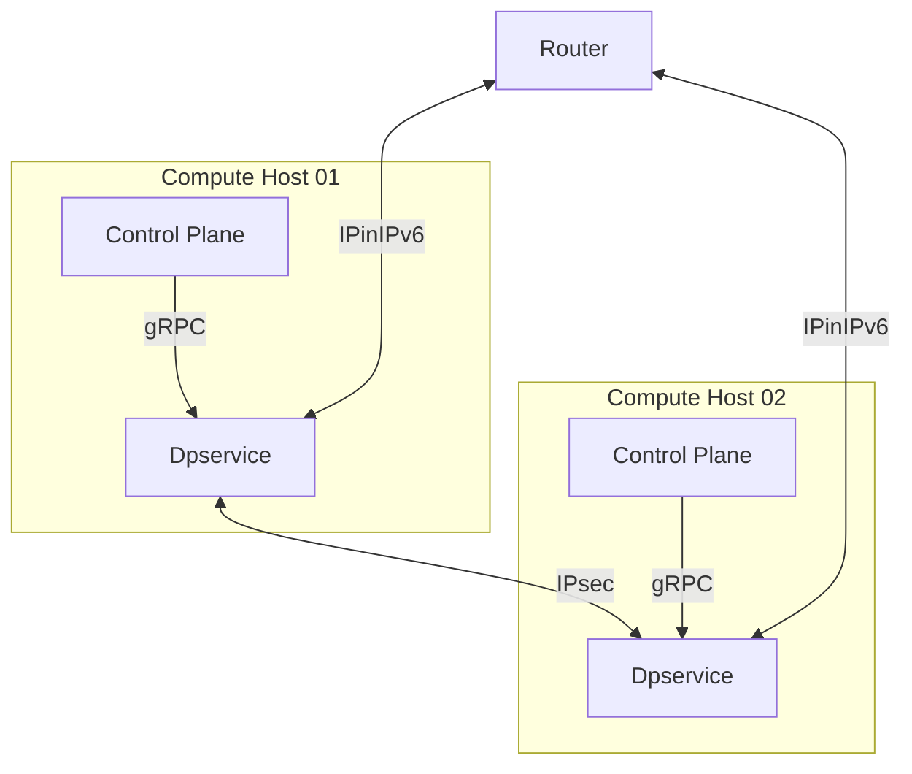

# IEP-NNNN: Underlay Encryption - IPsec encryption between compute hosts

## Table of Contents

- [Summary](#summary)
- [Motivation](#motivation)
    - [Goals](#goals)
    - [Non-Goals](#non-goals)
- [Proposal](#proposal)
- [Alternatives](#alternatives)

## Summary

Implementation of an underlay encryption for the traffic between compute hosts. 
This touches on the networking component dpservice in the first place. In further iterations it also touches instances that use the Linux kernel for their networking.

## Motivation

Currently, the underlay network does not provide encryption. Applications are, however, free to apply encryption on the overlay network. 
In case applications are unable to communicate securely (for whatever reason), it would be desirable to offer underlay network encryption.
Regulatory requirements like BSI Grundschutz (see NET.1.1.A7 Absicherung von schützenswerten Informationen (B)) reflect the need for secure communication via secure protocols or secured network segments. 
Encryption of the underlay traffic in the right scope would thus make it possible to run software that cannot communicate securely itself and align with regulatory requirements.

### Goals

- Add the possibility to encrypt IPv6-encapsulated traffic between dpservice instances using IPsec Encapsulating Security Payload ([ESP](https://www.rfc-editor.org/info/rfc4303)) in transport mode

### Non-Goals

- This IEP does not handle the topic of key exchange. It is assumed that a symmetric key and salt will be made available to both 
  communication ends of a Security Association (SA). 

- The decision of whether to encrypt outgoing packets in dpservice will rely on a sound decision in the control plane. That means that when no encryption for a combination of underly IPv6 address and VNI is configured packets will be sent unencrypted.

- The option to offload encryption to the network card will be part of a subsequent enhancement.

- This IEP aims for East-West traffic encryption between compute hosts running dpservice. North-South traffic between compute hosts and routers will not be encrypted and thus routers will not be in the focus. However, all changes made here shall avoid complications with future integration with the Linux kernel XFRM interface.

## Proposal

### Related open issues

There are already 2 open issues related to this topic:

- https://github.com/ironcore-dev/metalnet/issues/320
- https://github.com/ironcore-dev/roadmap/issues/69

This IEP was a first draft that combined key exchange and encryption in one draft:
- https://github.com/ironcore-dev/enhancements/pull/38

### Overview:


```mermaid
---
config:
---
graph TD
    router["Router"]
    control_plane1["Control Plane"]
    control_plane2["Control Plane"]

    dpservice01["Dpservice"]
    dpservice02["Dpservice"]

    

    router <---> |IPinIPv6| dpservice01
    router <---> |IPinIPv6| dpservice02

    dpservice01 <--> |IPsec| dpservice02 

    subgraph Compute Host 01
        control_plane1 --> |gRPC| dpservice01
    end

    subgraph Compute Host 02
        control_plane2 --> |gRPC| dpservice02
    end

```

### dpservice

The DPDK graph in dpservice has to be extended with encryption and decryption nodes. 
Those nodes shall use the IPSec implementation provided by [DPDK](https://doc.dpdk.org/guides/prog_guide/ipsec_lib.html). 
The library already provides the means for AES-256-GCM encryption/decryption as well as a SA database. 
It also handles sequence numbers to protect against replay attacks. 
The DPDK library will be configured to use ESP in transport mode for the single SAs. 
As there is already encapsulation and decapsulation in place, this will basically result in tunnel mode ESP.

Packets will be encrypted on the sender side after the IPv6-encapsulation and before the decapsulation on the receiver side. 
This ensures, that only traffic leaving/entering the physical host, will be encrypted and decrypted to avoid unnecessary packet processing overhead. 
A Security Association (SA) is created for each remote compute host, or rather remote dpservice instance, with which the local dpservice has to exchange packets. 
These SAs are stored in the DPDK SA database. 
The key as well as the salt (see [RFC4106](https://datatracker.ietf.org/doc/html/rfc4106)) for the encrypted connection is provided over the gRPC connection. 
Whenever a new key is pushed, a new SA gets created. Pushing a new key for an established SA will be used for key rotation.

For backwards compatibility the encryption must be configurable for each pair of compute hosts. That is, as long as a route to another compute host is configured without an SA, the traffic will further be unencrypted until encryption is enabled.

#### Scope of Encryption
As of now dpservice already sends IP-in-IPv6 packets in the underlay network. This shall not be changed at the moment. Rather we intend to encrypt that encapsulated package as a whole. Following [RFC4303](https://www.rfc-editor.org/info/rfc4303/) (ESP in transport mode), the resulting package structure would be this:

```
| IPv6 Header | ESP Header | Inner IPv4 Package | ESP Trailer | ICV* |
<-------Unencrypted------->                                   <Unenc.>
               <---------------Authenticated------------------>
                            <-------------Encrypted----------->

*ICV - Integrity Check Value 
```

Using ESP introduces state to all connections.  
An SA fixes a method of encryption and the related key plus potential salt for each pair of communication partners. That information is identified by an SPI (Security Parameter Index) which is included in each packet. 
It is added by the sender when crafting the ESP header and read by the receiver to choose the matching key for decryption. 
The information about which connection to protect is stored in the Security Policy Database (SPD). The information on how to handle the protection is stored in the Security Association Database (SAD).   
When replay protection is required, the sequence numbers of each packet must be known on both sides. The sender needs to increment it one by one and the receiver needs to keep track of the last numbers to keep his replay window up to date. On the receiver side, this state cannot be rebuilt purely from the information contained in one or multiple packets. Making a stateful tracking of packets necessary for both communication ends.

In case statelessness is desired instead, [RFC4304 - 3.3.3](https://www.rfc-editor.org/info/rfc4303/#section-3.3.3) contains information on how ESP should be configured without replay protection. This configuration is on per SA basis, meaning that some SAs could be replay protected while others are not. DPDK's IPsec library allows enabling and disabling of sequence number checks via the [replay_win_sz](https://doc.dpdk.org/api/structrte__security__ipsec__xform.html#a85eb02412c31f7fbf81890c32a231b95). This makes it configurable whether this state should be built and maintained.

#### Impact on HA abilites
According to the [documentation](https://github.com/ironcore-dev/dpservice/blob/main/docs/ha/README.md), a running dpservice can have an HA failover instance running in active-standby. In order to avoid packet loss or interruptions in the failover case, a sync connection is in place to keep the already existing state of the active and the standby instance synchronized. The SPD as well as the SAD would need to be kept in sync as well as the single SAs. Without replay protection this should simply be the same gRPC calls to both instances as they would only need to care about the key material and SPI. With replay protection, however, the current sequence number would need to be maintained. Synchronizing each increment of an SA sequence number counter would be quite an overhead in synchronisation traffic.

Hence, a possibly strategy would be working with batches of sequence numbers on the sending side. That is, the sender locks a range of n sequence numbers and shares that information with the standby instance (e.g. current range: 0,500). In case of a failover the standby node starts with the next range of packets. Larger sequence numbers should not be a problem for the general replay protection functionality.

On the receiving end, the standby node would need to know the last known sequence number. If it knows a lower one it is prone to replay attacks. The easiest approach would be starting at sequence number 0 which comes with the downside that any packet could be replayed. If the active instance synchronizes its last known sequence number only every x seconds or packets, the window of potential replay packets would be smaller. With that information the SAs on the standby instance could be kept up to date and a failover should work seamlessly.

#### Key rotation
During key rotation there will need to be two SAs in place between a pair of compute hosts. The old one that shall be superseded and the new one.
The new one needs to be active on the receiver side before the sender can start sending with it. The old one needs to be in place on the receiver side for a grace period beginning with the moment when it is deleted from the sender side for as long as packets may still be on the wire. Coordinating this is the responsibility of the control plane that handles the key management.

#### Hardware support
This first IEP aims for the general functionality using software based cryptography in the first step. To do so, we will be using the cryptodevice, security and IPsec libraries in DPDK. Handling the protocol operations (i.e. inserting the ESP Header and Trailer as well as ICV) is done via DPDK's IPsec library functions. Doing the actual cryptography is done via a [software crypto device](https://doc.dpdk.org/guides/cryptodevs/aesni_mb.html) to make use of crypto instructions (AES-NI). In the next steps hardware crypto accelerators (e.g. Intel QAT) and SmartNICs/DPUs (e.g. Bluefield-2) shall be used for [lookaside or inline](https://doc.dpdk.org/guides/prog_guide/rte_security.html#design-principles) handling of crypto operations or the whole protocol.

### gRPC connection

We propose new endpoints for handling of the Security Associations with functionalities Create and Delete.

```
enum CipherSuite {
	AES_GCM_256 = 0;
	//CHACHA20_POLY1305 = 1;          //for future reference, start with AES-GCM
}

message CreateSecurityAssociationRequest {
	uint32 spi = 1;
	TrafficDirection direction = 2;   //ingress or egress SA, reuse existing TrafficDirection enum
	uint64 remote_prefix = 3;         //64 bit prefix of remote dpservice
	uint32 vni = 4;                   //vni this SA is valid for
	CipherSuite cipher_suite = 5;
	bytes crypt_key = 6;              //de-/encryption key
	bytes crypt_salt = 7;             //static salt for SA lifetime, part of per packet nonce
	uint32 replay_window_size = 8;    //0 for no replay protection, >0 for replay window size of receiver
}

message CreateSecurityAssociationResponse {
	Status status = 1;
}

message DeleteSecurityAssociationRequest {
	uint32 spi = 1;
}

message DeleteSecurityAssociationResponse {
	Status status = 1;
}

//Security Associations (IPsec)
rpc CreateSecurityAssociation(CreateSecurityAssociationRequest) returns (CreateSecurityAssociationResponse) {}
rpc DeleteSecurityAssociation(DeleteSecurityAssociationRequest) returns (DeleteSecurityAssociationResponse) {}
```
The intended use of this would be to create a Security Association for the combination of a prefix of another dpservice and a VNI either for the egress (packet will be encrypted) or the ingress path (packet will be decrytpted). For the lifetime of the SA the key and the salt are static and must match the lengths defined by the cipher suite.  
For key rotation a new SA would be added via the create call and after waiting for a grace period the delete call can be used to delete the old SA via the SPI. Handling this needs to be done by the control plane. As each key rotation also creates a new SA with new SPI, key and salt, there is no explicit reason to have an update endpoint. Especially since the key rotation is to be managed by the control plane, an endpoint that suggests that dpservice handles the rotation could be misleading.

This design hides the security policy handling (see "processing choices" in the [Security Policy Database (SPD)](https://www.rfc-editor.org/info/rfc4301/#section-4.4.1)). The idea would be to create an SPD entry with processing choice PROTECT when the create endpoint is called. If one existed with BYPASS before it would be changed accordingly. A BYPASS entry would exist beforehand if encryption would not be enabled from the start. To make this possible the CreateRoute call would need to be changed to create the policy entry. If the CreateRoute call would find an PROTECT entry in the SPD (the SA would be installed before the route) it must not change it to a BYPASS entry. Packets sent to destinations that have no SPD entry (i.e. no entry is found for a key made of `remote_prefix` and `vni`) would be dropped. This would mean an implicit DISCARD entry as default. If a PROTECT entry already exists, the connected SPI would need to be changed for the new one and a new SA would need to be created.

Setting the `replay_window_size` of an SA to 0 would fullfil the request of disabled replay protection that was asked for in the past. As this is a setting that is based on each SA it would need to be reissued for each SA creation.


## Alternatives

- If no encryption is required, the additional graph nodes could simply be left out of the graph. However, since the graph creation relies on preprocessor commands, the configuration is fixed at compile time. It is possible to simply skip the operation of the nodes with application runtime configuration but the nodes would still be part of the graph. The "feature arc" functionality of the graph library seems to bridge that gap but it is still handled as experimental in the [documentation](https://doc.dpdk.org/api/rte__graph__feature__arc_8h.html) and apparently it comes with a performance impact even if the feature is not used ([DPDK summit presentation](https://youtu.be/AENsTjL_6eA?list=PLo97Rhbj4ceI3ENbGEN44mBVkLtdYB0DC&t=1493)).

- If one wanted to change the scope of the encryption, in order to be able to see the encapped IPv4 headers, for example, it would in principle be possible to move the encrypt node in the graph in front of the encapsulate node. This way we'd end up with an encrypted IPv4 package with visible headers, that would then be encapped. I.e.:

  ```
  | IPv6 Header | Inner IPv4 Header | ESP Header | Inner IPv4 Package | ESP Trailer | ICV |
  <----------Unencrypted----------->                                                <Unenc.>
                                     <---------------Authenticated------------------>
                                                  <------------Encrypted------------>
  
  ```
  Reconfiguring the graph for this would need to be done simultaneously for both communicating dpservices. For the same reasons as listed in the last bullet point, this is something that would be a candidate for the feature arc functionality of the graph library or something that needs custom compile time/runtime configuration.

- Instead of adding encryption as an extra node after encapsulation (and vice versa with decryption/decapsulation), the DPDK IPsec library's tunnel mode ESP could be explored and the nodes could be merged. This would mean to use NULL encryption algorithm (i.e. no encryption) as long as a route is supposed to be unencrypted. It would also mean not just to attach new nodes but change existing ones to a larger degree. 