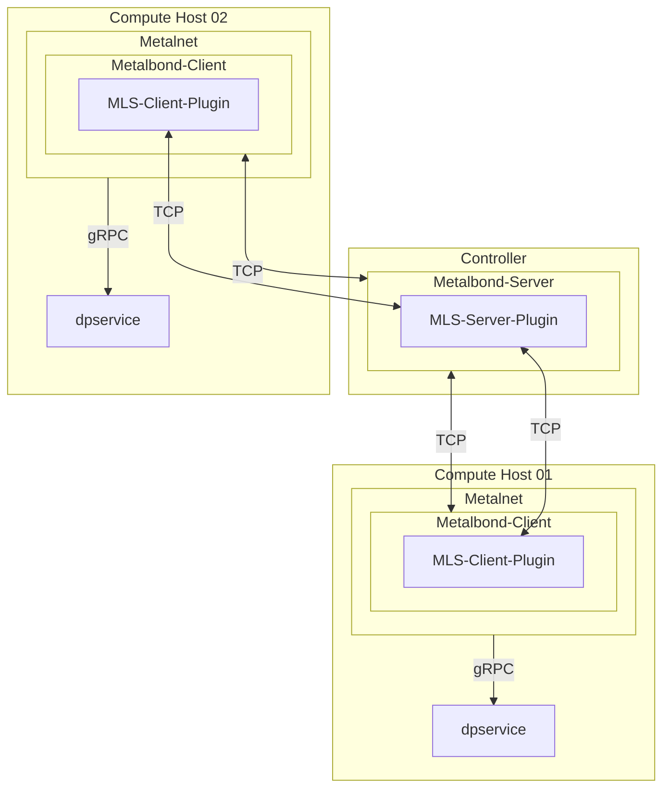

# IEP-NNNN: Underlay Encryption - Key Exchange

## Table of Contents

- [Summary](#summary)
- [Motivation](#motivation)
    - [Goals](#goals)
    - [Non-Goals](#non-goals)
- [Proposal](#proposal)
- [Alternatives](#alternatives)

## Summary

Implementation of a key exchange between hosts to provide keys for the underlay encryption of PR https://github.com/ironcore-dev/enhancements/pull/50.

## Motivation

To provide keys for the underlay encryption in dpservice, symmetric keys have to be shared between hosts with dpservice.

### Goals

- Add a key exchange into Metalbond
- Using the MLS protocol for the first variant for the key exchange

### Non-Goals

## Proposal

### Related previous issues and PRs

There are already 2 open issues related to this topic:

- https://github.com/ironcore-dev/metalnet/issues/320
- https://github.com/ironcore-dev/roadmap/issues/69

There was also a first version for an enhancement document for the underlay encryption:

- https://github.com/ironcore-dev/enhancements/pull/38

This was closed, because as a result of the community discussion, the originally intended use of IKEv2 was replaced by MLS. Additionally, it was decided to split it into 2 smaller enhancement proposals.

### Overview

### Selected protocol

In the [previous PR](https://github.com/ironcore-dev/enhancements/pull/38) there was a discussion about the method, 
how to share the key for the encryption. 
In the end the conclusion was to use MLS (<https://datatracker.ietf.org/doc/rfc9420/>) as first implementation, instead of IKEv2.

The [OpenMLS](https://github.com/openmls/openmls) library is so far the best maintained implementation of the MLS protocol, so it is used for this first version of the underlay encryption. 
Because OpenMLS is written in Rust, a small glue layer has to be implemented to expose the necessary functions to the Go code. 

### Metalbond

To avoid a new CRD for the SA (Security Association) as well as a resulting CR for each connection and because it also has to work on hosts without Metalnet, 
the key exchange will be integrated into Metalbond. 
The MLS protocol differs quite a lot from the Metalbond protocol. 
It would be a very big change to modify the Metalbond protocol to also make all MLS traffic possible over it. 
Besides this, this would mean MLS-specific extensions into the protocol. 
This would result into a hard commitment for the MLS protocol for the future. 
To avoid this problem of MLS-specific modifications, the MLS traffic will be handled by a second parallel TCP connection with a MLS server next to the Metalbond server. 
Additionally all MLS-related features on server and client side will be encapsulated into a MLS plugin, 
which will be used by Metalbond. There will be 2 plugins, one for the client-side and one for the server-side. 
This way it will be easily possible in the future to exchange MLS for example by an IKEv2 plugin, if necessary. 
So there is no hard commitment for the usage of MLS to share keys over different hosts.

### Metalnet

Metalnet also has to be extended:

1. The key, salt and SPI, coming from the key exchange from Metalbond, 
   have to be forwarded to dpservice. The key will be pushed into dpservice, before the route is created by Metalbond.

2. A new bool property has to be added to the Network CR to tell Metalnet whether the network has to be encrypted or not.

## Alternatives

- Use a Go-native MLS implementation like https://github.com/thomas-vilte/mls-go or https://github.com/trevex/mls-go instead of the OpenMLS Rust implemenation with the glue layer. However, these repositories seem to be much less actively maintained than OpenMLS.