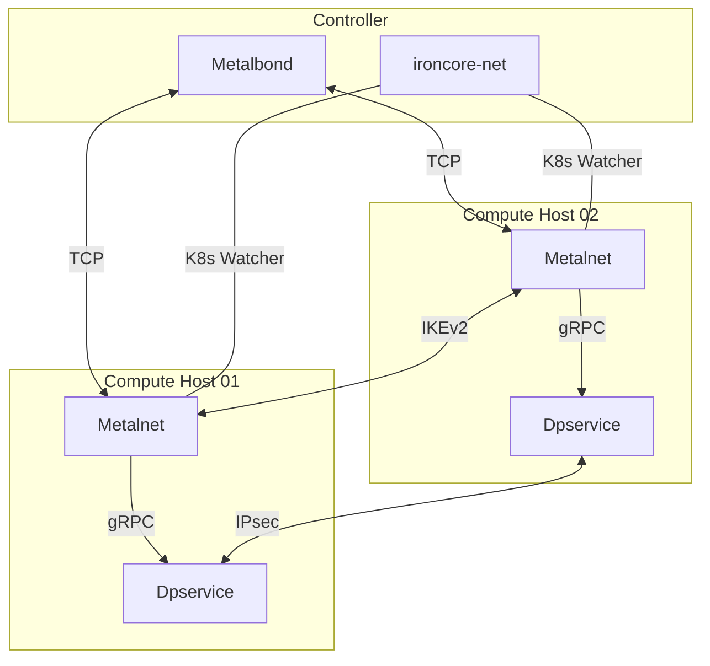

# IEP-NNNN: Underlay Encryption

## Table of Contents

- [Summary](#summary)
- [Motivation](#motivation)
    - [Goals](#goals)
    - [Non-Goals](#non-goals)
- [Proposal](#proposal)
- [Alternatives](#alternatives)

## Summary

Implementation of an underlay encryption for the traffic between compute hosts. 
This involves several networking components of IronCore such as
dpservice and Metalnet.

## Motivation

Currently, the underlay network does not provide encryption. 
However, to align with regulatory requirements for specific security domains (for example as mandated by the BSI), encryption is necessary. 
Once enabled, all underlay traffic originating from Metalnet must be encrypted to ensure data confidentiality and integrity.

### Goals

- Encrypt IPv6-encapsulated traffic leaving the compute host using IPsec
- Exchange keys for the IPsec encryption via IKEv2 between Metalnet instances

### Non-Goals

- Encryption per VNI is not in scope of this enhancement, because of the scalability. 
  A Security Association (SA) can effectively only be established between 2 communication partners because of the sequence counter for replay protection. 
  So even with encryption on host level instead of VNI level, this already will result in `2 * NUMBER_OF_HOST^2` SAs on each host in the worst case.
  When also considering the VNI, the amount of SAs can easily explode in bigger deployments. The `2 *` comes from the fact 
  that there is a SA for each direction, so each connection effectively creates 2 SAs.

- The gRPC connection between Metalnet and dpservice is not encrypted additionally, because Metalnet and its connected dpservice are on the same host.

- The option to offload encryption to the network card will be part of a subsequent enhancement.
  Melanox BlueField network cards also support crypto offloading for IPsec (<https://docs.nvidia.com/doca/sdk/ipsec-crypto-offload/index.html>). 
  This will require a secondary version of the implementation in the code, because the workflow between the CPU and the offloaded version is different. 

## Proposal

### Related open issues

There are already 2 open issues related to this topic:

- https://github.com/ironcore-dev/metalnet/issues/320
- https://github.com/ironcore-dev/roadmap/issues/69

The proposal for this enhancement document differs slightly from these issues and also goes more into technical details.

### Overview:



### dpservice

The DPDK graph in dpservice has to be extended with encryption and decryption nodes. 
Those nodes shall use the IPSec implementation provided by DPDK (<https://doc.dpdk.org/guides/prog_guide/ipsec_lib.html>). 
The library already provides the means for AES-256-GCM encryption/decryption as well as a SA database. 
It also handles sequence numbers to protect against replay attacks. 
The DPDK library will be configured to use ESP in transport mode for the single SAs. 
As there is already encapsulation and decapsulation in place, this will basically result in tunnel mode ESP.

Packets will be encrypted on the sender side after the IPv6-encapsulation and before the decapsulation on the receiver side. 
This ensures, that only traffic leaving/entering the physical host, will be encrypted and decrypted to avoid unnecessary packet processing overhead. 
An SA is created for each remote compute host, or rather remote dpservice instance, with which the local dpservice has to exchange packets. 
These SAs are stored in the DPDK SA database. 
The key for the established connection is provided by the Metalnet instance over the gRPC connection. 
Whenever a new key is pushed by Metalnet, a new SA is created, even for target hosts, for which a SA already exist, in order to enable proper key rotation.

### gRPC connection

There are three endpoint changes necessary:

- New fields will be added to the existing `CreateRoute` endpoint to encrypt the new connection right from the beginning:
    - Authenticated Encryption with Associated Data (AEAD)
        - 36 Byte key material, which also contains the salt
    - Security Parameters Index (SPI)
        - 32 bit identifier for the IKEv2/IPsec connection
    - IP of the other communication partner for identification of the key

- A new endpoint will be added to provide a key for key rotation.
  This endpoint will be triggered every time when the IKEv2 in Metalnet shares a new key.
  In case the related connection was previously unencrypted, which can be the case during a migration to this new version, 
  then the connection will start becoming encrypted.

- A new endpoint will be added to trigger the deletion of expired keys. Deletion shall happen after a short grace period with a brief overlap of old and new key to tolerate delayed traffic.

### Metalnet

The IPsec implementation of DPDK doesn't provide an implementation for IKEv2 (`Internet Key Exchange`), 
but this special key exchange is highly required for IPsec by the RFC 
`Cryptographic Algorithm Implementation Requirements and Usage Guidance for Encapsulating Security Payload (ESP) and Authentication Header (AH)` 
(<https://datatracker.ietf.org/doc/html/rfc8221#section-3>). 
To have better control over the management of the targets and to conform more closely to the general workflow in IronCore, 
the key exchange will be done between Metalnet instances rather than between dpservices. 

strongSwan, where IPsec and IKEv2 belongs to, 
provides the Go library `govici` (<https://github.com/strongswan/govici>) to interact with the strongSwan library, which handles the IKEv2 process. 
The strongSwan IKEv2 also includes automatic exchange of new keys after a certain amount of time and the connection of the key exchange is already encrypted. 
So an additional distribution of a public key over the Metalbond is not necessary. 
Furthermore the salt value for the encryption is also already generated and shared by the IKEv2 library.
Only the address of the target is required. 

Per default, the key exchanged by IKEv2 is stored in the vici module of the kernel. 
Because the govici is only some kind of remote control, it can not intercept the process and catch the key before the kernel.
In a regular case the IPsec would also run in the kernel itself and can access the key there. 
Because DPDK runs in user-space and so does the IPsec in this proposal too, this workflow is not possible. 
After exchanging a key with the library, Metalnet has to read the key from the kernel module to get it into the user-space, 
for example with the netlink library (<https://github.com/vishvananda/netlink>) by a separate watch-loop, 
and then push this key through the gRPC connection to its local dpservice instance.

To avoid multiple IKEv2 runs for the same source-target-host-pair, Metalnet has to track the connections in a central config-map to avoid duplications.

IKEv2 runs asynchronous. So when initially announcing a new route, 
a wait function has to be added to wait until the IKEv2 has successfully exchanged keys, 
to ensure that keys are available for the encryption and decryption on both hosts, 
before Metalnet marks the connections ready for traffic.

Because the encryption is done at the underlay traffic and the CRD's affect the overlay networks, 
the new config to enable and disable the IKEv2 and IPsec will be added as a new `--enable-network-encryption` CLI flag to the Metalnet binary. 

Following additional changes to the Metalnet environment are necessary:

- For IKEv2 normally certificates are used to secure the connection. 
  Every host needs its own certificate provided by the deploy process.

- In case that the Metalnet container doesn't run in privilege mode, to be able to interact with the kernel in the IKEv2 process, the container needs additional capabilities:

    ```
    NET_ADMIN
    NET_RAW
    ```

- Required system packages in the Metalnet pod:

    ```
    strongswan
    strongswan-pki
    strongswan-swanctl
    libcharon-extra-plugins
    iproute2
    kmod
    ```

- For IKEv2 the `UDP` ports `500` and `4500` have to be open on the hosts.

- Manifest of the Metalnet pods requires an update for the new CLI flag.

## Alternatives

- Use PSK (Pre-Shared-Key) instead of certificates for the IKEv2 process. This key then would have to be stored in a key manager like Vault, where all Metalnet hosts can access the key to be able to participate in the IKEv2 process. 

- Custom implementations for encryption and key exchange:

    - Create a custom key exchange mechanism between the Metalnet hosts based on TLS as alternative to IKEv2 key exchange.
    - Add a custom encryption with AES256 in DPDK as an alternative to IPsec packet encryption.

    Both would have a huge impact on the workload for implementation and maintenance and it would have a significant impact on security. Especially things like a BSI certification would be substantially harder with custom implementations for encryption and key exchange.

- No dedicated enable/disable toggle per CLI, always-on encryption.

- Instead of adding a new parameter to the initialize gRPC message, an enable flag, like for Metalnet, could be added to dpservice too, to enable encryption. This would require changes to the rollout process.

- Instead of adding encryption as an extra node after encapsulation (and vice versa with decryption/decapsulation), the DPDK IPsec library's tunnel mode ESP could be explored and the nodes could be merged. This would mean to use NULL encryption algorithm (i.e. no encryption) as long as a route is supposed to be unencrypted. It would also mean not just to attach new nodes but change existing ones. 