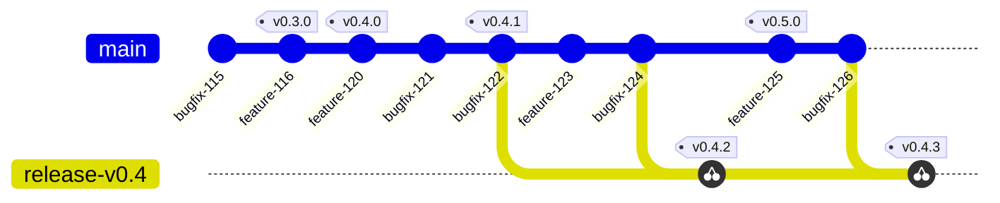
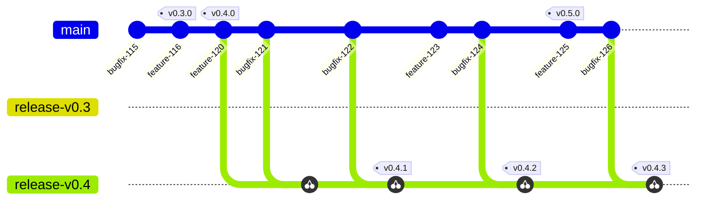
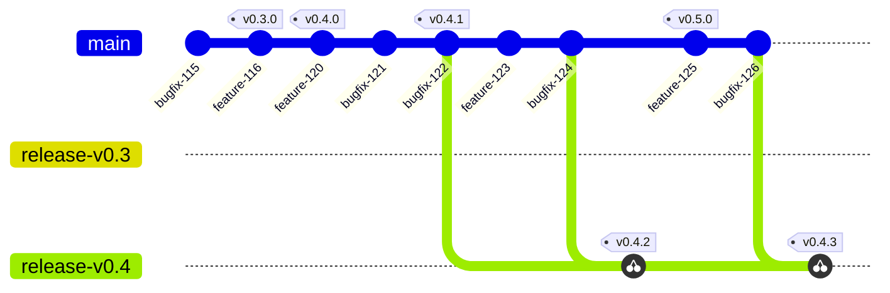
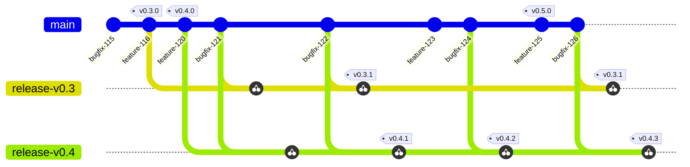

# IEP-TBD: IronCore Release Branching

## Table of Contents

- [Summary](#summary)
- [Motivation](#motivation)
    - [Goals](#goals)
    - [Non-Goals](#non-goals)
- [Proposal](#proposal)
- [Alternatives](#alternatives)

## Summary

This proposal discusses the approach for management of release versions, release branches in git and GitHub, and when a release branch should be created that is suitable for backports to older versions.

This proposal optimizes for pre-1.0 releases during development, where using an older release is less likely.

## Motivation

Versions currently in production and in development can diverge. It can become necessary to apply ("backport") a fix that is in the current development branch (`main`) to an older release, without taking on all other changes from that development branch, e.g. new features.

This ensures that an old in-production version receives the necessary fix. At the same time there is no risk to introduce a change in behavior because of new features or breaking changes that live in the `main` branch.

The focus on pre-1.0 development is to keep overhead to a minimum during this phase. Once longer-term support releases are available, one of the discussed alternatives will likely be more suitable.

### Goals

1. Define a procedure for handling maintenance releases that require backports of fixes applied ot the main development branch.
2. Define, when maintenance branches should be available 

### Non-Goals

Definition of automation, tooling, etc. The first goal is to define, live and refine the process.

## Proposal

The proposed workflow focuses on creating a maintenance branch just before a new maintenance release is necessary and when `main` contains changes that require a version jump.

While `main` only contains bugfixes for the current release, releases can be cut from `main`.

The main benefits:
* Minimal amount of maintenance branches as they're only created when a maintenance release is necessary.
* During initial development, there is not as much need for maintenance releases yet, and development together with bug fixing continues somewhat linear in the `main` branch.
* Good application of the [YAGNI][yagni] principle, specifically in term of [keeping options open for later when the need arises][yagni-beck].

The drawbacks:
* Determining the 'branching off point' for the maintenance branch as part of automation (e.g. bugfix PR backport script / workflow) is not as clear-cut and may require manual intervention or complex logic to create the branch at the correct place on the fly.
* Once there are different versions in operation in different installations, backports may become more frequent.

### Notes on dependency updates

Dependency updates are managed via GitHub's dependabot. Dependabot sets labels on PRs to indicate the "severity" of the change and may suggest a minor version bump.

There are cases where this is not what we want. Accordingly, we need to review the labels on dependabot PRs accordingly to reflect the version bumps we deem necessary for our own releases.

## Alternatives

The following section discusses alternative approaches that are either nuances or entirely different points of view.

### 1. Always create a `release-vX.Y` branch when a new version is started. {#always}

The branch `release-vX.Y` is created as soon as the release version of the `main` branch moves forward.

Benefits:
* The maintenance branch always exists and the automation already exists (e.g. in [`metal-operator`](https://github.com/ironcore-dev/metal-operator/pull/669)).
* The full release history for a particular line of releases is visible in the maintenance branch.

Drawbacks:
* Unused release branches remain "empty" and need to be cleaned up manually, or clutter the branch namespace.
* All bugfixes require a cherry-pick and are copies of the fixes in `main`, even when `main` may only contain fixes and nothing that warrants another larger version jump.

### 2. Auto-create maintenance branch on version jump {#onchange}

This approach is an alternative to the main proposal, where the maintenance branch is created whenever the main branch diverges to the point of requiring a version jump (e.g. new feature, breaking change).

The branch `release-v0.3` will be created once v0.4.0 is released, pointing to the last `v0.3.x` tag.

Benefits:
* The maintenance branch always exists and is available for backports when needed.
* The maintenance branch does not contain "copies" of fixes from [Alternative 1](#always) before a version jump becomes necessary.

Drawbacks:
* Branches without additional commits may still exist and need to be cleaned up eventually.

### 3. Kubernetes style backports to the last N supported versions {#n-last}

The Release Drafter is already using PR labels to determine, by how much to bump the next release version.

Using those same labels (`bug`, etc.), can be used to pick candidates for backporting to a number of maintenance branches, and can be automated.

The commit graph below shows support for 2 previous releases, i.e. `release-v0.3` and `release-v0.4`.

The example specifically shows a divergence for the 0.3 branch, as features introduced in 0.4 may have required fixes, so not all commits need to be cherry-picked to all maintenance branches.

Benefits:
* All supported version are automatically available with all applicable backports for applicable fixes.
* This is how Kubernetes does it. Developers and users of IronCore can rely on the fact that there is a maintenance release for their branch with the latest fixes automatically.

Drawbacks:
* Complex manual or automated setup with edge cases. Automation requires precise labeling of PRs and strong discipline.
* Potentially a lot of unused releases, cherry-picks and maintenance branches for the current and rather homogeneous landscape of IronCore deployments. Likely a better fit once there is higher adoption and the overhead of automation is outweighed by the demand for maintenance releases.

## Acknowledgements

The options were explored during discussion with [@afritzler][afritzler], [@friegger][friegger], [@adracus][adracus], [@gonzolino][gonzolino], [@balpert89][balpert89], [@shawnsarwar][shawnsarwar] and [@peanball][peanball].

[yagni]: https://en.wikipedia.org/wiki/You_aren%27t_gonna_need_it
[yagni-beck]: https://newsletter.kentbeck.com/p/the-cost-yagni-was-never-about
[afritzler]: https://github.com/afritzler
[friegger]: https://github.com/friegger
[adracus]: https://github.com/adracus
[gonzolino]: https://github.com/gonzolino
[balpert89]: https://github.com/balpert89
[shawnsarwar]: https://github.com/shawnsarwar
[peanball]: https://github.com/peanball
