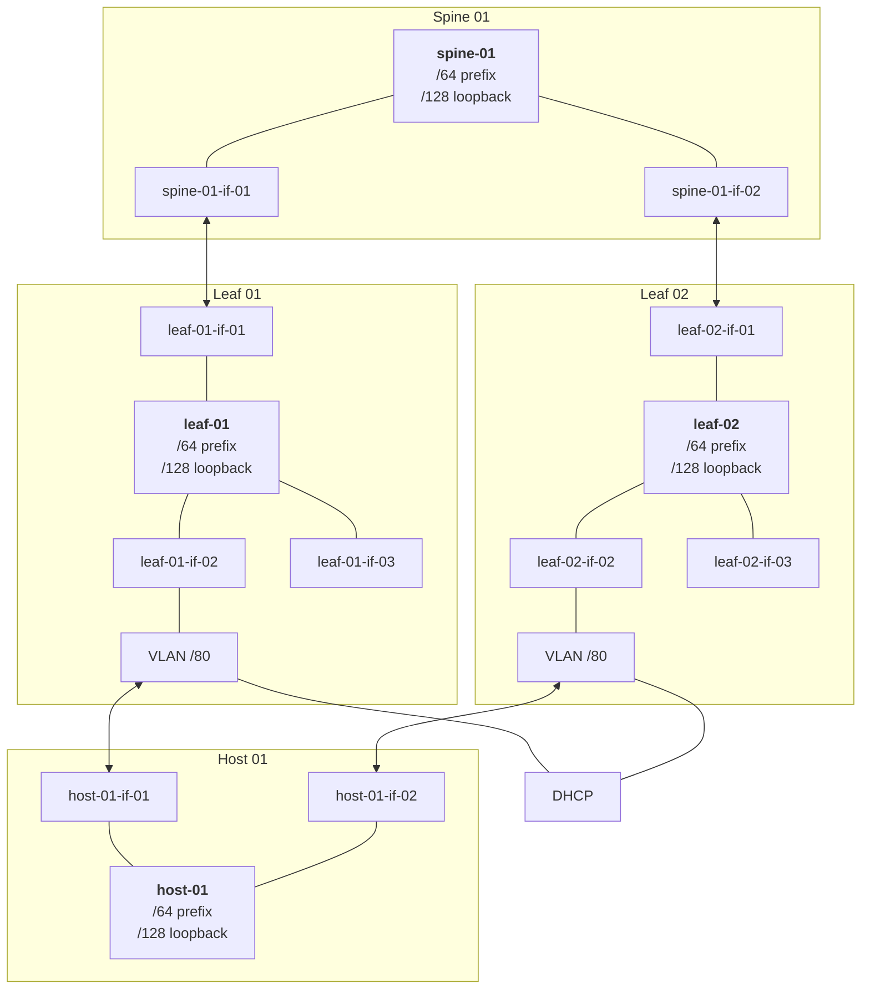

# IEP-tbd: Wire

## Table of Contents

- [Summary](#summary)
- [Motivation](#motivation)
  - [Goals](#goals)
  - [Non-Goals](#non-goals)
- [Proposal](#proposal)
- [Alternatives](#alternatives)

## Summary

Implement an extensible and declarative switch network API that expresses
how we configure our network.

## Motivation

We currently provision or switches with central templates and lots
of implicit configuration. Instead of this, we want to make the configuration
more explicit while staying vendor independent. Additionally, we want to
have a clear language on how we configure our switches and when.

Frequent reconfiguration of switches during runtime has shown in countless
examples that it jeopardizes the stability of the network. As such,
reconfiguration must be brought to a minimum and made absolutely explicit
when it happens.

### Goals

* Stay vendor-independent
* Declarative, making it absolutely explicit and significant when switches
  are (re)configured.

### Non-Goals

* Non-stable state for our switches - A configuration must be applied
  once and not be continuously re-evaluated, causing unexpected side effects.
* Imperative API - The network should be declarative.

## Proposal

### Current State

Our network follows a CLOS topology: A level of spines, leaves
and hosts connected to the leaves.

Each host is connected to two leaves and each leave is connected to
two spines for extra redundancy.

The connection towards the hosts from the leaves is also 'wrapped'
with a VLAN per interface since only by using VLANs, DHCP relay
can be specified. This is necessary to be able to boot servers
using network boot (PXE / HTTP).

Each member of the topology (spine, leaf, host) runs BGP unnumbered
for route distribution.

Diagram of an excerpt of how our network looks like:



For configuring our switches we currently use ZTP (zero-touch-provisioning).
We render the configuration from a template, since we know how our
cabling looks like. To keep the template small we use BGP unnumbered,
allowing us to omit each neighbor's ASN number.

This setup configures switches *once*, avoiding frequent switch
reconfiguration. Switch reconfiguration is known to be one of the
core issues causing severe network disruption.

### Declarative Network Design

When designing the resources for a new API, we start with
the ground truths we know about: Our cabling / topology plan.

At the cluster scope, we define the following types:

* **`Device`** representing an 'unconfigured' switch.
* **`DeviceInterface`** representing an interface of a device.
* **`Server`** representing an arbitrary host.
* **`ServerInterface`** representing an interface of a server.

We distinguish between devices and servers since devices and their
interfaces can be reconciled (e.g. set admin state `Up` / `Down`,
apply some configuration) while servers are externally managed (e.g.
by their OS / config).

The cluster-scoped **`Link`** resource specifies which interface
(either `DeviceInterface` or `ServerInterface`) is linked to each other.
For each such connection, a `Link` is created.

To actually make a `Device` function as a switch inside the network,
routing traffic properly, a namespaced `Switch` resource is created.
This `Switch` resource references a `Device` and, once accepted by
the `Device`, the `Device` references the `Switch` back. The spec
of a `Switch` is immutable. Once a `Switch` is created, this causes
the underlying device to be reconfigured. By having a dedicated `Switch`
resource, we gain several core benefits:

* Reconfiguration becomes explicit: We do not want to continuously
  reconfigure a switch but only configure it as seldom as possible.
  A single object contains everything needed to configure the switch.

* Having a single object means the implementors of this API can construct
  the most optimal way to apply the entire configuration: E.g. depending
  on the vendor, the sequence to apply a configuration can heavily differ.
  Having the entire desired configuration at once is the only allow a vendor
  to implement this correctly.

* By having a `Switch` resource that expresses the effective configuration,
  rolling / draining traffic and gracefully switching between two `Switch`
  configurations can be done. One could e.g. think of a higher-level type
  and controller that first drains traffic, removes the old `Switch` object
  once drained and creates a new one once ready.

Since servers also cooperatively take part in our networking, a `Host` resource
is what a `Switch` is to a `Device`: It expresses how a `Host` should join the network.
In contrast to a `Switch` however, this is not reconciled on a switch level but
depends on the server itself.

### Sample Resources

Spine (cluster-scoped):

```yaml
apiVersion: wire.ironcore.dev
kind: Device
metadata:
    name: spine-01
spec:
  providerID: sonic://spine-01
---
apiVersion: wire.ironcore.dev
kind: DeviceInterface
metadata:
  name: spine-01-if-01
spec:
  handle: sonic://if-01
  adminState: Up
  deviceRef:
    name: spine-01
```

Leaf (cluster-scoped):

```yaml
apiVersion: wire.ironcore.dev
kind: Device
metadata:
    name: leaf-01
spec:
  providerID: sonic://leaf-01
---
apiVersion: wire.ironcore.dev
kind: DeviceInterface
metadata:
  name: leaf-01-if-01
spec:
  handle: sonic://if-01
  adminState: Up
  deviceRef:
    name: leaf-01
---
apiVersion: wire.ironcore.dev
kind: DeviceInterface
metadata:
  name: leaf-01-if-02
spec:
  handle: sonic://if-02
  adminState: Up
  deviceRef:
    name: leaf-01
```

Server (cluster-scoped):

```yaml
apiVersion: wire.ironcore.dev
kind: Server
metadata:
    name: host-01
---
apiVersion: wire.ironcore.dev
kind: ServerInterface
metadata:
  name: host-01-if-01
serverRef:
  name: host-01
```

Links (cluster-scoped):

```yaml
apiVersion: wire.ironcore.dev
kind: Link
metadata:
    name: spine-01-if-01-leaf-01-if-01
endpoints:
- deviceInterfaceRef:
    name: spine-01-if-01
- deviceInterfaceRef:
    name: leaf-01-if-01
---
apiVersion: wire.ironcore.dev
kind: Link
metadata:
  name: leaf-01-if-01-host-01-if-01
endpoints:
- deviceInterfaceRef:
    name: leaf-01-if-01
- serverInterfaceRef:
    name: host-01-if-01
```

Spine switch (namespaced):

```yaml
apiVersion: wire.ironcore.dev
kind: Switch
metadata:
  namespace: my-lab
  name: spine-01
spec:
  deviceRef:
    name: spine-01
  ips:
  - loopback ip
  prefixes:
  - prefix
  bgp:
    asn: 0001
    peerGroups:
    - name: leafs
      neighbors:
      - interfaceRef:
          name: spine-01-if-01
```

Leaf switch (namespaced):

```yaml
apiVersion: wire.ironcore.dev
kind: Switch
metadata:
  namespace: my-lab
  name: leaf-01
spec:
  deviceRef:
    name: leaf-01
  ips:
  - loopback ip
  prefixes:
  - prefix
  vlans:
  - id: 1000
    prefix: foo/80
    dhcpRelay: my-dhcp-server
    deviceInterfaceRefs:
    - name: leaf-01-if-02
  bgp:
    asn: 0002
    peerGroups:
    - name: spines
      neighbors:
      - interfaceRef:
          name: leaf-01-if-01
    - name: leafs
      neighbors:
      - vlan: 1000
```

Host (namespaced):

```yaml
apiVersion: wire.ironcore.dev
kind: Host
metadata:
  namespace: my-lab
  name: host-01
spec:
  serverRef:
    name: host-01
  ips:
  - ip1
  prefixes:
  - prefix
  bgp:
    asn: 0003
    peerGroups:
    - name: leafs
      neighbors:
      - serverInterfaceRef:
          name: host-01-if-01
```

These manifests configure a network roughly as described above: A
spine connected to a leaf and that leaf connected to a host.

The leaf also creates a VLAN around the interface towards the host
to configure DHCP relay.

### Resource Lifecycle

As the cluster-scoped resources (`Device`, `DeviceInterface`, `Server`,
`ServerInterface`, `Link`) represent the ground truth (cabling + topology),
they are created by an administrator.

There must be one controller or multiple controllers that watch the `Device`s
and `DeviceInterface`s that are managed by it. Once a `Switch` shows up in a
namespace referencing a `Device`, the controller checks whether the `Device` is
in-use by another switch. This is done via the `Device.spec.switchRef` field:

```yaml
# Unclaimed device
apiVersion: wire.ironcore.dev
kind: Device
metadata:
  name: my-unclaimed-device
spec:
  providerID: test://my-unclaimed-device
---
# Claimed device
apiVersion: wire.ironcore.dev
kind: Device
metadata:
  name: my-claimed-device
spec:
  providerID: test://my-claimed-device
  switchRef:
    namespace: my-switch-namespace
    name: my-switch-name
    uid: my-switch-uid
```

By referencing the `Switch` back from the `Device`, we ensure that there can ever
only be at most one `Switch` on a `Device`.

Once a `Switch` has successfully claimed a `Device`, it is resolved exactly once.
The resolved configuration of the switch is handed over to a runtime interface,
actually applying the configuration to the physical switch.

To reconfigure a `Device`, the `Switch` must be deleted and a new `Switch` resource
has to be created. This makes reconfiguration absolutely explicit.

### Controller Implementation

As mentioned, there are valid scenarios to where a single controller can
manage a fleet of devices or, depending on the device vendor, an agent can
be deployed onto the device managing all switch configurations assigned to that
device.

Both deployment / implementation scenarios can be realized with the following
runtime interface (go spec):

```go
type Runtime interface {
	// ProviderName is the name of the provider.
	ProviderName() string

	// DeviceID returns the provider internal ID of the device specified with by the given device name.
	DeviceID(ctx context.Context, device string) (string, error)
	// ApplySwitch applies the given switch configuration to the specified device.
	ApplySwitch(ctx context.Context, device string, cfg *SwitchConfig) error
	// DeleteSwitch deletes the given switch configuration from the specified device.
	DeleteSwitch(ctx context.Context, device string) error

	// InterfaceID returns the provider internal ID of the interface specified by the given interface name.
	InterfaceID(ctx context.Context, iface string) (string, error)
	// InterfaceState returns the state of the interface specified by the given interface name.
	InterfaceState(ctx context.Context, iface string) (*InterfaceState, error)
	// SetInterfaceAdminState sets the admin state of the interface specified by the given interface
	// name to the given value.
	SetInterfaceAdminState(ctx context.Context, iface string, adminState bool) error
}
```

## Alternatives

- Continue to use static templating.
