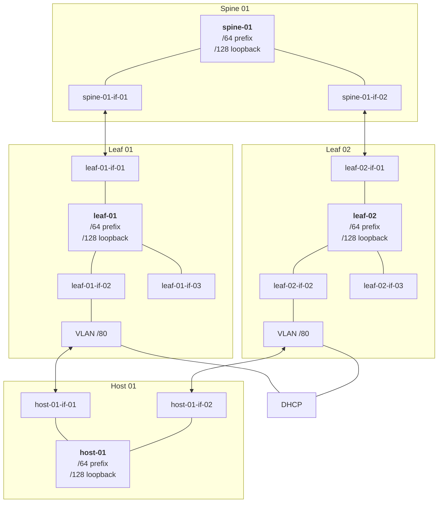

# IEP-tbd: Wire

## Table of Contents

- [Summary](#summary)
- [Motivation](#motivation)
  - [Goals](#goals)
  - [Non-Goals](#non-goals)
- [Proposal](#proposal)
- [Alternatives](#alternatives)

## Summary

Implement an extensible and declarative network configuration API that expresses
how we configure our network.

## Motivation

We currently provision or switches with central templates and lots
of implicit configuration. Instead of this, we want to make the configuration
more explicit while staying vendor independent. Additionally, we want to
have a clear language on how we configure our switches and when.

Frequent reconfiguration of switches during runtime has shown in countless
examples that it jeopardizes the stability of the network. As such,
reconfiguration must be brought to a minimum and made absolutely explicit
when it happens.

### Goals

* Stay vendor-independent
* Declarative, making it absolutely explicit and significant when switches
  are (re)configured.

### Non-Goals

* Non-stable state for our switches - A configuration must be applied
  once and not be continuously re-evaluated, causing unexpected side effects.
* Imperative API - The network should be declarative.

## Proposal

### Current State

Our network follows a CLOS topology: A level of spines, leaves
and hosts connected to the leaves.

Each host is connected to two leaves and each leave is connected to
two spines for extra redundancy.

The connection towards the hosts from the leaves is also 'wrapped'
with a VLAN per interface since only by using VLANs, DHCP relay
can be specified. This is necessary to be able to boot servers
using network boot (PXE / HTTP).

Each member of the topology (spine, leaf, host) runs BGP unnumbered
for route distribution.

Diagram of an excerpt of how our network looks like:


```mermaid
graph TD
    spine-01["`**spine-01**
    /64 prefix
    /128 loopback`"]
    spine-01-if-01
    spine-01-if-02

    leaf-01["`**leaf-01**
    /64 prefix
    /128 loopback`"]
    leaf-01-vlan-host-01["`VLAN /80`"]

    leaf-02["`**leaf-02**
    /64 prefix
    /128 loopback`"]
    leaf-02-vlan-host-01["`VLAN /80`"]

    host-01["`**host-01**
    /64 prefix
    /128 loopback`"]

    dhcp["DHCP"]

    %% Spines
    subgraph Spine 01
    spine-01---spine-01-if-01
    spine-01---spine-01-if-02
    end

    %% Leafs
    subgraph Leaf 01
    leaf-01-if-01---leaf-01
    leaf-01---leaf-01-if-02
    leaf-01---leaf-01-if-03
    leaf-01-if-02---leaf-01-vlan-host-01
    end

    subgraph Leaf 02
    leaf-02-if-01---leaf-02
    leaf-02---leaf-02-if-02
    leaf-02---leaf-02-if-03
    leaf-02-if-02---leaf-02-vlan-host-01
    end

    %% Hosts
    subgraph Host 01
    host-01-if-01---host-01
    host-01-if-02---host-01
    end

    %% VLANs to DHCP
    leaf-01-vlan-host-01---dhcp
    leaf-02-vlan-host-01---dhcp

    %% Spines to Leafs
    spine-01-if-01 <-->leaf-01-if-01

    spine-01-if-02 <-->leaf-02-if-01


    %% Leafs to Hosts
    leaf-01-vlan-host-01 <-->host-01-if-01

    leaf-02-vlan-host-01<-->host-01-if-02
```

For configuring our switches we currently use ZTP (zero-touch-provisioning).
We render the configuration from a template, since we know how our
cabling looks like. To keep the template small we use BGP unnumbered,
allowing us to omit each neighbor's ASN number.

This setup configures switches *once*, avoiding frequent switch
reconfiguration. Switch reconfiguration is known to be one of the
core issues causing severe network disruption.

### Declarative Network Design

When designing the resources for a new API, we start with
the resources we can schedule configuration on.

At the cluster scope, we define the following types:

* **`wire.Node`** representing a node ready to act as a cell of our network.
* **`wire.Interface`** representing an interface of a `Node`.

To actually make a `Node` function as a cell inside the network,
routing traffic properly, a namespaced `Cell` resource is created.
This `Cell` resource references a `Node` and, once accepted by
the `Node`, the `Node` references the `Cell` back. The spec
of a `Cell` is immutable. Once a `Cell` is created, this causes
the underlying node to be reconfigured. By having a dedicated `Cell`
resource, we gain several core benefits:

* Reconfiguration becomes explicit: We do not want to continuously
  reconfigure a switch but only configure it as seldom as possible.
  A single object contains everything needed to configure the switch.

* Having a single object means the implementors of this API can construct
  the most optimal way to apply the entire configuration: E.g. depending
  on the vendor, the sequence to apply a configuration can heavily differ.
  Having the entire desired configuration at once is the only allow a vendor
  to implement this correctly.

* By having a `Cell` resource that expresses the effective configuration,
  rolling / draining traffic and gracefully switching between two `Cell`
  configurations can be done. One could e.g. think of a higher-level type
  and controller that first drains traffic, removes the old `Cell` object
  once drained and creates a new one once ready.

### Sample Resources

Spine (cluster-scoped):

```yaml
apiVersion: wire.ironcore.dev
kind: Node
metadata:
    name: spine-01
spec:
  providerID: sonic://spine-01
---
apiVersion: wire.ironcore.dev
kind: Interface
metadata:
  name: spine-01-if-01
spec:
  handle: sonic://if-01
  adminState: Up
  nodeRef:
    name: spine-01
```

Leaf (cluster-scoped):

```yaml
apiVersion: wire.ironcore.dev
kind: Node
metadata:
    name: leaf-01
spec:
  providerID: sonic://leaf-01
---
apiVersion: wire.ironcore.dev
kind: Interface
metadata:
  name: leaf-01-if-01
spec:
  handle: sonic://if-01
  adminState: Up
  nodeRef:
    name: leaf-01
---
apiVersion: wire.ironcore.dev
kind: Interface
metadata:
  name: leaf-01-if-02
spec:
  handle: sonic://if-02
  adminState: Up
  nodeRef:
    name: leaf-01
```

Server (cluster-scoped):

```yaml
apiVersion: wire.ironcore.dev
kind: Node
metadata:
  name: host-01
---
apiVersion: wire.ironcore.dev
kind: Interface
metadata:
  name: host-01-if-01
serverRef:
  name: host-01
```

Spine cell (namespaced):

```yaml
apiVersion: wire.ironcore.dev
kind: Cell
metadata:
  namespace: my-lab
  name: spine-01
spec:
  nodeRef:
    name: spine-01
  id: bgp://1
  ips:
  - loopback ip
  prefixes:
  - prefix
  neighbors:
  - interfaceRef:
    name: spine-01-if-01
```

Leaf cell (namespaced):

```yaml
apiVersion: wire.ironcore.dev
kind: Cell
metadata:
  namespace: my-lab
  name: leaf-01
spec:
  nodeRef:
    name: leaf-01
  id: bgp://2
  ips:
  - loopback ip
  prefixes:
  - prefix
  neighbors:
  - interfaceRef: leaf-01-if-01
  - interfaceRef: leaf-01-if-02
    dhcpRelay: my-dhcp-server
```

Host cell (namespaced):

```yaml
apiVersion: wire.ironcore.dev
kind: Cell
metadata:
  namespace: my-lab
  name: host-01
spec:
  nodeRef:
    name: host-01
  id: bgp://3
  ips:
  - ip1
  prefixes:
  - prefix
  neighbors:
  - interfaceRef:
      name: host-01-if-01
```

These manifests configure a network roughly as described above: A
spine connected to a leaf and that leaf connected to a host.

### Resource Lifecycle

As the cluster-scoped resources (`Node`, `Interface`) represent the ground truth,
and they are created by an administrator.

There must be one controller or multiple controllers that watch the `Node`s
and `Interface`s that are managed by it. Once a `Cell` shows up in a
namespace referencing a `Node`, the controller checks whether the `Node` is
in-use by another cell. This is done via the `Node.spec.cellRef` field:

```yaml
# Unclaimed node
apiVersion: wire.ironcore.dev
kind: Node
metadata:
  name: my-unclaimed-node
spec:
  providerID: test://my-unclaimed-node
---
# Claimed node
apiVersion: wire.ironcore.dev
kind: Node
metadata:
  name: my-claimed-node
spec:
  providerID: test://my-claimed-node
  cellRef:
    namespace: my-cell-namespace
    name: my-cell-name
    uid: my-cell-uid
```

By referencing the `Cell` back from the `Node`, we ensure that there can ever
only be at most one `Cell` on a `Node`.

Once a `Cell` has successfully claimed a `Node`, it is resolved exactly once.
The resolved configuration of the cell is handed over to a runtime interface,
actually applying the configuration to the physical switch.

To reconfigure a `Node`, the `Cell` must be deleted and a new `Cell` resource
has to be created. This makes reconfiguration absolutely explicit.

### Controller Implementation

As mentioned, there are valid scenarios to where a single controller can
manage a fleet of nodes or, depending on the device vendor, an agent can
be deployed onto the node managing all cell configurations assigned to that
node.

Both deployment / implementation scenarios can be realized with the following
runtime interface (go spec):

```go
type Runtime interface {
	// ProviderName is the name of the provider.
	ProviderName() string

	// NodeID returns the provider internal ID of the node specified with by the given node name.
	NodeID(ctx context.Context, node string) (string, error)
	// ApplyCell applies the given cell configuration to the specified node.
	ApplyCell(ctx context.Context, node string, cfg *CellConfig) error
	// DeleteCell deletes the given cell configuration from the specified node.
	DeleteCell(ctx context.Context, node string) error

	// InterfaceID returns the provider internal ID of the interface specified by the given interface name.
	InterfaceID(ctx context.Context, iface string) (string, error)
	// InterfaceState returns the state of the interface specified by the given interface name.
	InterfaceState(ctx context.Context, iface string) (*InterfaceState, error)
	// SetInterfaceAdminState sets the admin state of the interface specified by the given interface
	// name to the given value.
	SetInterfaceAdminState(ctx context.Context, iface string, adminState bool) error
}
```

## Alternatives

- Continue to use static templating.
